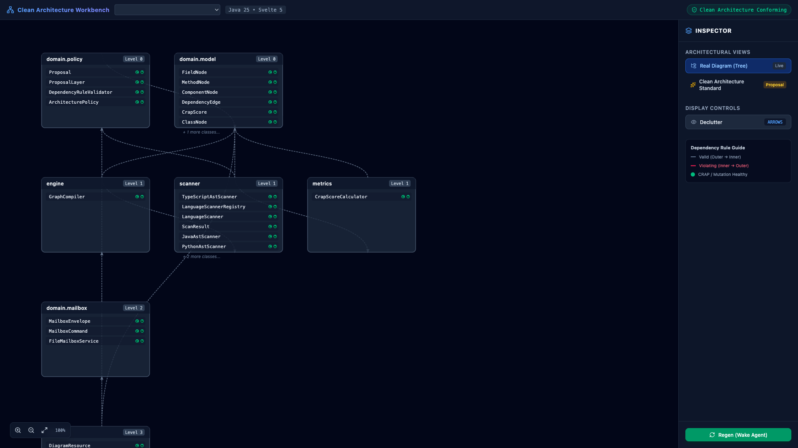

# Archlens — Clean Architecture Dynamic Workbench

[](https://github.com/fmatar/archlens/actions/workflows/ci.yml)
[](https://openjdk.org/)
[](https://quarkus.io/)
[](https://svelte.dev/)
[](Dockerfile)
[](#polyglot-language-support)
[](https://opensource.org/licenses/Apache-2.0)

> *"The Dependency Rule: Source code dependencies must point only inward, toward higher-level policies."*  
> — **Robert C. Martin (Uncle Bob)**

An interactive, real-time architectural visualization workbench, polyglot Clean Architecture governance engine, and agent-driven refactoring platform for modern software systems.

```bash
# Instant Quickstart via Container (analyzing your current project)
docker run -d -p 8088:8088 -v $(pwd):/workspace ghcr.io/fmatar/archlens:latest
```
Visit **`http://localhost:8088`** to interactively explore and validate your architecture.

  
*(Full HD 1080p Video Teaser: [`media/archlens-teaser.mp4`](media/archlens-teaser.mp4) &bull; Extended Journey: [`media/archlens-user-journey.mp4`](media/archlens-user-journey.mp4) &bull; Animated Preview: [`media/archlens-teaser.gif`](media/archlens-teaser.gif))*

---

## The Vision & Inspiration

Robert C. Martin’s writings have been a foundational reference point throughout modern software engineering. *Clean Code*, *Clean Architecture*, and the SOLID principles established how we protect core business policies from the volatility of frameworks, delivery mechanisms, and external databases.

When Uncle Bob open-sourced [unclebob/uml-viewer](https://github.com/unclebob/uml-viewer), the vision was captivating: transforming the Dependency Rule from an abstract diagram in a book into a living, tangible feedback loop right on our screens. Seeing that experimental prototype sparked an immediate ambition: *bring this exact philosophy into the heart of modern polyglot enterprise environments.*

We took Uncle Bob's core thesis and engineered a production-grade workbench built from the ground up:

1. **Polyglot AST Engine (SPI)**: Pluggable AST and dependency scanners supporting **Java 25**, **Python**, **Rust**, **TypeScript / JavaScript**, **Go**, and **Clojure**.
2. **Fluid Reactive Architecture Canvas**: Svelte 5 and SVG rendering capable of dynamically visualizing and decluttering hundreds of classes across concentric layers with bidirectional dependency arrows.
3. **Multi-Project Architecture Governance**: Point the workbench at any repository on your machine—from standalone services to large multi-module codebases—to validate architectural boundaries against version-controlled policies.
4. **Hierarchical Edge Bundling & Spatial Virtualization**: Catmull-Rom spline clustering, viewport frustum culling, and Semantic Macro LOD maintaining 60 FPS performance on complex dependency meshes.
5. **Tactile Interaction & Loading Telemetry**: Canvas radar scrim, optimistic source modals with code skeleton shimmers, and autonomous agent sonar sweeps during refactoring passes.
6. **Agent Refactoring Loop**: Agnostic file-based mailbox protocol (`.uml-viewer/`) allowing autonomous AI agents (such as Google Antigravity) to receive refactoring commands, fix violations, run tests, and push hot-reloads to the canvas.
7. **Single-Container Deployment**: Fully packaged as an all-in-one container serving both the embedded Svelte 5 SPA and Quarkus REST/SSE backend on port `8088`.

---

## Architecture at a Glance


---

## Key Workstation Capabilities

### 1. Dynamic Project Switcher & Filesystem Explorer (`⌘O` / `Ctrl+O`)
Switch between local repositories without restarting the server:
- **Native OS Directory Picker (`Browse...`)**: Launch your operating system's native folder selection dialog (macOS Finder) with a single click.
- **Interactive Directory Explorer**: Navigate folders visually with clickable breadcrumbs, quick jump bookmarks (`Home`, `Current Workspace`, `Labs`), instant folder filtering, and automatic project framework classification badges (`Maven`, `Gradle`, `Node`, `Java`, `Git`).
- **Recursive Multi-Module Source Discovery**: Mono-repos and multi-module projects are scanned automatically across all nested module paths (`**/src/main/java`).
- **Dynamic Package Deduction**: If a project lacks `.uml-viewer/policy.json`, Archlens deduces the common package prefix and project title on-the-fly.

### 2. Hierarchical Edge Bundling (`B`) & Violation X-Ray (`V`)
Tame dense dependency webs. Edge bundling routes connections along concentric radial paths using smooth Catmull-Rom splines, reducing visual noise. Toggle Violation X-Ray (`V`) to fade compliant dependencies into the background and isolate rule violations in bold crimson.

### 3. Stepwise Node Class Micro-Pagination
Component cards display a clean 5-class window with intuitive navigation chevrons (`1–5 of N`). Selecting any class instantly highlights dependencies and centers the class in the Inspector drawer.

### 4. Semantic Macro LOD & Frustum Virtualization (`C`)
Large codebases remain responsive through automatic viewport frustum culling and real-time node visibility counters. Zooming out smoothly collapses fine-grained component cards into Macro Level Badges to retain structural clarity.

### 5. Tactile Feedback & Diagnostic Empty State
- **Diagnostic Empty State Card**: When opening a repository without architectural components or prior to policy initialization, an interactive guidance card provides direct actions to switch workspaces or wake the refactoring companion.
- **Canvas Radar Scrim**: Frosted glass overlay with animated pulse beacon while AST compilation and layout calculate.
- **Optimistic Source Code Modal**: Instant modal opening with a multi-line skeleton shimmer during file retrieval.
- **Agent Sonar Wave**: Animated cyan wave sweeps down the canvas while AI agents execute refactoring tasks.
- **Inspector Filter**: Class search with instant match counter pill (`X / Y found`) and clear button.

---

## Polyglot Language Support

Archlens features a modular Service Provider Interface (SPI) for language scanners:

| Language | Ecosystem & AST Engine | File Extensions | Capabilities |
| :--- | :--- | :--- | :--- |
| **Java 25** | JavaParser 3.26 | `.java` | Records, Sealed Types, Interfaces, Class Hierarchies, Inward Dependency Rules |
| **Python** | Python AST Visitor | `.py` | Modules, Classes, Functions, Imports, Relative Imports |
| **TypeScript / JS** | Babel AST / Regex Scanner | `.ts`, `.tsx`, `.js`, `.jsx` | Classes, Interfaces, Named Imports, ESM Re-exports |
| **Rust** | Syn / Cargo AST Extractor | `.rs` | Structs, Traits, Impls, Module `use` Paths |
| **Go** | Go AST Tree Walker | `.go` | Structs, Interfaces, Package Imports, Type Definitions |
| **Clojure** | EDN & Regex AST Scanner | `.clj`, `.cljs`, `.edn` | Namespaces (`ns`), `(:require ...)`, `def`, `defn`, Protocols |

---

## Quick Start

### Prerequisites
* Java 21 or Java 25 (OpenJDK / GraalVM)
* Apache Maven 3.9+
* Node.js 18+ and pnpm / npm

### 1. Start the Backend
```bash
cd backend
./mvnw clean quarkus:dev
```
* Backend starts at `http://localhost:8088`.

### 2. Start the Frontend
```bash
cd frontend
npm install
npm run dev
```
* Open `http://localhost:5173` in your browser.

---

## Enforcing Clean Architecture in Your Projects

You can analyze any repository by placing an architectural policy file at the root of that project: `.uml-viewer/policy.json`.

### Automated Policy Installation via Agent Skill (`archlens-install-policy`)

You can install and configure the architectural policy in any codebase automatically using the **`archlens-install-policy`** skill for **Claude Code**, **Gemini CLI**, and **Google Antigravity**:

1. **Invoke via AI Agent**:
   Instruct your agent:
   > *"Install the Archlens Clean Architecture policy in this project."*

2. **Standalone Scaffolding Script**:
   Execute the zero-dependency Python generator directly in your target repository:
   ```bash
   python3 skills/archlens-install-policy/scripts/init_policy.py --path /path/to/target/project
   ```

3. **What It Configures**:
   - **`.uml-viewer/policy.json`**: Inspects build files (`pom.xml`, `build.gradle`, `package.json`, etc.), computes common package prefixes, and organizes packages into concentric rings:
     - **Level 0 (Domain Core)**: Entities, domain models, and business logic
     - **Level 1 (Application)**: Use cases, interactor services, and ports
     - **Level 2 (Adapters)**: Controllers, REST endpoints, presenters, and repositories
     - **Level 3 (Infrastructure)**: Databases, frameworks, external drivers, and network clients
   - **`.uml-viewer/workbench.config.json`**: Configures the local Archlens server endpoint (`http://localhost:8088`).
   - **Agent Companion Protocols (`CLAUDE.md` & `AGENTS.md`)**: Configures Claude Code, Gemini, and Antigravity to process refactoring mailbox tasks (`REGEN`, `APPLY_PROPOSAL`, `REFRESH_CRAP`) and enforce inward dependency rules.

### Manual Configuration Example (`.uml-viewer/policy.json`)

```json
{
  "title": "Core Banking Platform",
  "src": "src/main/java",
  "prefix": "com.enterprise.banking",
  "hierarchical": true,
  "proposals": [
    {
      "id": "clean-architecture",
      "name": "Hexagonal Clean Core",
      "layers": [
        { 
          "id": "domain", 
          "label": "Level 0: Domain Entities & Core Rules", 
          "classes": ["com.enterprise.banking.domain.*"] 
        },
        { 
          "id": "application", 
          "label": "Level 1: Application Services & Use Cases", 
          "classes": ["com.enterprise.banking.usecase.*"] 
        },
        { 
          "id": "adapters", 
          "label": "Level 2: Gateways, Persistence & REST", 
          "classes": ["com.enterprise.banking.adapter.*"] 
        }
      ]
    }
  ]
}
```

### Navigating Projects in the Workbench
Pass the target project root via URL parameter or select it from the header dropdown / project switcher:
```text
http://localhost:5173/?projectRoot=/path/to/your/repository
```

* **Inward Dependencies (Valid)**: Subtle dashed/solid links pointing from outer rings (adapters) to inner rings (application/domain).
* **Outward Violations (Red)**: Any reference from an inner layer to an outer layer is immediately flagged with a bold red directional arrow and status badge alert.
* **Virtual Proposals**: Evaluate alternative package reorganizations ("What-If" scenarios) in the UI before modifying a single line of source code.

---

## AI Agent Integration (Claude Code & Gemini / Antigravity)

Archlens provides full bidirectional integration with autonomous coding assistants:
- **Claude Code**: Guidelines and mailbox protocol defined in [`CLAUDE.md`](CLAUDE.md).
- **Google Antigravity & Gemini**: Companion skills located in [`.agents/skills/uml-workbench-companion/SKILL.md`](.agents/skills/uml-workbench-companion/SKILL.md) and [`skills/archlens-install-policy/SKILL.md`](skills/archlens-install-policy/SKILL.md).

### Mailbox Protocol (`.uml-viewer/`)
When you click **Regen (Wake Agent)** in the UI:
1. The workbench posts a command to `.uml-viewer/to-agent.json`.
2. The AI agent evaluates red dependency violations, refactors code (e.g. introducing interfaces or applying the Dependency Inversion Principle), runs unit tests, and signals the viewer.
3. The UI automatically hot-reloads the new architecture diagram.

---

## Verification & Quality Gates

Run the comprehensive quality suite locally:

```bash
# Backend Quality Gates & Unit Tests
mvn clean verify

# Frontend Unit Tests & Svelte Diagnostic Checks
npm --prefix frontend run check
npm --prefix frontend run test

# Playwright End-to-End Regression Suite
npm --prefix frontend run test:e2e
```

---

## Documentation

* [Inspiration and Vision](docs/guide/INSPIRATION_AND_VISION.md)
* [Comprehensive User Guide](docs/guide/USER_GUIDE.md)
* [C4 Architecture Specification](docs/specs/C4_ARCHITECTURE.md)
* [JaCoCo Test Coverage Report](docs/specs/JACOCO_COVERAGE_REPORT.md)
* [SDLC Compliance Report](docs/specs/SDLC_COMPLIANCE_REPORT.md)
* [Changelog](CHANGELOG.md)

---

## Contributing

We welcome contributions from the community! Check out our [Contributing Guide](CONTRIBUTING.md) to get started with local development, quality standards, and PR workflows.

Please also review our [Code of Conduct](CODE_OF_CONDUCT.md) and [Security Policy](SECURITY.md).

---

## License

Licensed under the [Apache License, Version 2.0](LICENSE).  
See the [NOTICE](NOTICE) file for attribution and acknowledgements.
