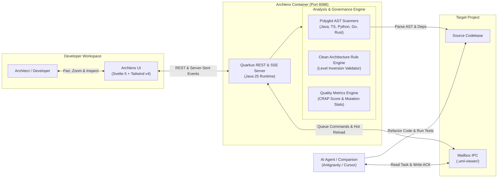

# Archlens — Clean Architecture Dynamic Workbench

[](https://github.com/fmatar/archlens/actions/workflows/ci.yml)
[](https://openjdk.org/)
[](https://quarkus.io/)
[](https://svelte.dev/)
[](https://github.com/fmatar/archlens/pkgs/container/archlens)
[](#polyglot-language-support)
[](https://opensource.org/licenses/Apache-2.0)

> *"The Dependency Rule: Source code dependencies must point only inward, toward higher-level policies."*  
> — **Robert C. Martin (Uncle Bob)**

An interactive, real-time architectural visualization workbench, polyglot Clean Architecture governance engine, and agent-driven refactoring platform for modern software systems.

```bash
# Instant Quickstart via Container (analyzing your current project)
docker run -d -p 8088:8088 -v $(pwd):/workspace ghcr.io/fmatar/archlens:latest
```
Visit **`http://localhost:8088`** to interactively explore and validate your architecture.


*(Quick Teaser: [`media/archlens-teaser.mp4`](media/archlens-teaser.mp4) &bull; Full Walkthrough: [`media/archlens-user-journey.mp4`](media/archlens-user-journey.mp4))*

---

## The Vision & Inspiration

Robert C. Martin’s writings have been a foundational reference point throughout modern software engineering. *Clean Code*, *Clean Architecture*, and the SOLID principles established how we protect core business policies from the volatility of frameworks, delivery mechanisms, and external databases.

When Uncle Bob open-sourced [unclebob/uml-viewer](https://github.com/unclebob/uml-viewer), the vision was captivating: transforming the Dependency Rule from an abstract diagram in a book into a living, tangible feedback loop right on our screens. Seeing that experimental prototype sparked an immediate ambition: *bring this exact philosophy into the heart of modern polyglot enterprise environments.*

We took Uncle Bob's core thesis and engineered a production-grade workbench built from the ground up:

1. **Polyglot AST Engine (SPI)**: Pluggable AST and dependency scanners supporting **Java 25**, **Python**, **Rust**, **TypeScript / JavaScript**, and **Go**.
2. **Fluid Reactive Architecture Canvas**: Svelte 5 and SVG rendering capable of dynamically visualizing and decluttering hundreds of classes across concentric layers with bidirectional dependency arrows.
3. **Multi-Project Architecture Governance**: Point the workbench at any repository on your machine—from standalone services to large multi-module codebases—to validate architectural boundaries against version-controlled policies.
4. **Agent Refactoring Loop**: Agnostic file-based mailbox protocol (`.uml-viewer/`) allowing autonomous AI agents (such as Google Antigravity) to receive refactoring commands, fix violations, run tests, and push hot-reloads to the canvas.
5. **Single-Container Deployment**: Fully packaged as an all-in-one container serving both the embedded Svelte 5 SPA and Quarkus REST/SSE backend on port `8088`.


---

## Architecture at a Glance



---

## Quick Start

### Prerequisites
* Java 21 or Java 25 (OpenJDK / GraalVM)
* Apache Maven 3.9+
* Node.js 18+ and pnpm / npm

### 1. Start the Backend
```bash
cd backend
./mvnw clean quarkus:dev
```
* Backend starts at `http://localhost:8088`.

### 2. Start the Frontend
```bash
cd frontend
npm install
npm run dev
```
* Open **`http://localhost:5173`** in your browser.

---

## Enforcing Clean Architecture in Your Projects

You can analyze any Java repository by placing an architectural policy file at the root of that project: `.uml-viewer/policy.json`.

### Example Policy (`.uml-viewer/policy.json`)

```json
{
  "title": "Core Banking Platform",
  "src": "src/main/java",
  "prefix": "com.enterprise.banking",
  "hierarchical": true,
  "proposals": [
    {
      "id": "clean-architecture",
      "name": "Hexagonal Clean Core",
      "layers": [
        { 
          "id": "domain", 
          "label": "Level 0: Domain Entities & Core Rules", 
          "classes": ["com.enterprise.banking.domain.*"] 
        },
        { 
          "id": "application", 
          "label": "Level 1: Application Services & Use Cases", 
          "classes": ["com.enterprise.banking.usecase.*"] 
        },
        { 
          "id": "adapters", 
          "label": "Level 2: Gateways, Persistence & REST", 
          "classes": ["com.enterprise.banking.adapter.*"] 
        }
      ]
    }
  ]
}
```

### Navigating Projects in the Workbench
Pass the target project root via URL parameter or select it from the header dropdown:
```text
http://localhost:5173/?projectRoot=/path/to/your/repository
```

* **Inward Dependencies (Valid)**: Shown as subtle dashed/solid grey links pointing from outer rings (adapters) to inner rings (application/domain).
* **Outward Violations (Red)**: Any import or reference from an inner layer to an outer layer is immediately flagged with a bold red directional arrow and a status badge alert.
* **Virtual Proposals**: Evaluate alternative package reorganizations ("What-If" scenarios) in the UI before moving a single class file.

---

## AI Agent Integration

This workbench includes a companion agent skill for **Google Antigravity** located in [`.agents/skills/uml-workbench-companion/SKILL.md`](.agents/skills/uml-workbench-companion/SKILL.md).

When you click **Regen (Wake Agent)** in the UI:
1. The workbench posts a command to `.uml-viewer/to-agent.json`.
2. The AI agent evaluates any red dependency violations, refactors the Java code (e.g. introducing interfaces or applying the Dependency Inversion Principle), runs unit tests, and signals the viewer.
3. The UI automatically hot-reloads the new architecture diagram.

---

## Documentation

* [Inspiration and Vision](docs/guide/INSPIRATION_AND_VISION.md)
* [Comprehensive User Guide](docs/guide/USER_GUIDE.md)
* [C4 Architecture Specification](docs/specs/C4_ARCHITECTURE.md)
* [JaCoCo Test Coverage Report](docs/specs/JACOCO_COVERAGE_REPORT.md)
* [SDLC Compliance Report](docs/specs/SDLC_COMPLIANCE_REPORT.md)

---

## Contributing

We welcome contributions from the community! Check out our [Contributing Guide](CONTRIBUTING.md) to get started with local development, quality standards, and PR workflows.

Please also review our [Code of Conduct](CODE_OF_CONDUCT.md) and [Security Policy](SECURITY.md).

---

## License

Licensed under the [Apache License, Version 2.0](LICENSE).  
See the [NOTICE](NOTICE) file for attribution and acknowledgements.
