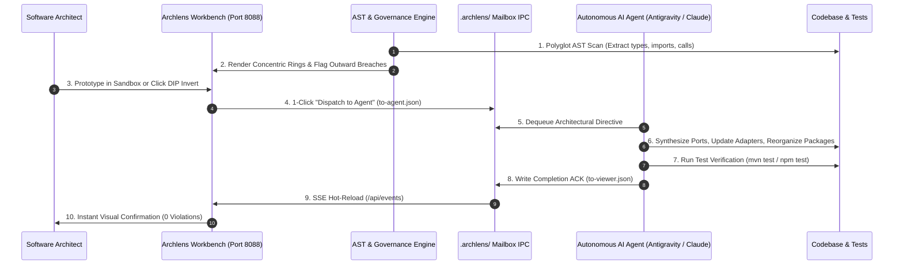

# Archlens — Dynamic Clean Architecture Workbench

[](https://github.com/fmatar/archlens/actions/workflows/ci.yml)
[](https://github.com/fmatar/archlens/actions/workflows/release.yml)
[](https://openjdk.org/)
[](https://quarkus.io/)
[](https://svelte.dev/)
[](Dockerfile)
[](#polyglot-language-support)
[](https://opensource.org/licenses/Apache-2.0)

> *"The Dependency Rule: Source code dependencies must point only inward, toward higher-level policies."*  
> — **Robert C. Martin (Uncle Bob)**

An interactive real-time architectural visualization workbench, polyglot Clean Architecture governance engine, and autonomous AI refactoring studio for modern software systems.

  
*(High Definition Video: [`media/archlens-teaser.mp4`](media/archlens-teaser.mp4) &bull; Extended Tour: [`media/archlens-user-journey.mp4`](media/archlens-user-journey.mp4) &bull; Animated Preview: [`media/archlens-teaser.gif`](media/archlens-teaser.gif))*

---

## 💡 How It Works

Archlens operates as a **closed-loop feedback system** that bridges high-level architectural design with low-level source code refactoring. It continuously protects codebases against architectural drift through three interconnected pillars:


```mermaid
sequenceDiagram
    autonumber
    participant Architect as Software Architect
    participant Workbench as Archlens Workbench (Port 8088)
    participant Core as AST & Governance Engine
    participant Mailbox as .archlens/ Mailbox IPC
    participant Agent as Autonomous AI Agent (Antigravity / Claude)
    participant Code as Codebase & Tests

    Core->>Code: 1. Polyglot AST Scan (Extract types, imports, calls)
    Core->>Workbench: 2. Render Concentric Rings & Flag Outward Breaches
    Architect->>Workbench: 3. Prototype in Sandbox or Click DIP Invert
    Workbench->>Mailbox: 4. 1-Click "Dispatch to Agent" (to-agent.json)
    Agent->>Mailbox: 5. Dequeue Architectural Directive
    Agent->>Code: 6. Synthesize Ports, Update Adapters, Reorganize Packages
    Agent->>Code: 7. Run Test Verification (mvn test / npm test)
    Agent->>Mailbox: 8. Write Completion ACK (to-viewer.json)
    Mailbox->>Workbench: 9. SSE Hot-Reload (/api/events)
    Workbench->>Architect: 10. Instant Visual Confirmation (0 Violations)
```

### 1. Polyglot AST Analysis & Governance Engine
Archlens reads your project source files directly. Pluggable Abstract Syntax Tree (AST) scanners (Java 25, Python, TypeScript, Go, Rust, Clojure) discover packages, classes, structs, and interfaces, mapping every import and function call against your configured Clean Architecture concentric tiers:
$$\text{Domain Core (Tier 0)} \longleftarrow \text{Application (Tier 1)} \longleftarrow \text{Adapters (Tier 2)} \longleftarrow \text{Infrastructure (Tier 3)}$$
Any source dependency violating Uncle Bob's Dependency Rule (pointing outward from inner tiers to outer details) is instantly flagged as an architectural breach.

### 2. Interactive Real-Time Canvas & "What-If" Sandbox
The Svelte 5 frontend visualizes components arranged in concentric rings. With built-in **Violation X-Ray (`V`)**, **Hierarchical Edge Bundling (`B`)**, and the **Architectural Sandbox (`S`)**, architects can simulate moving classes between rings in-memory to immediately view violation deltas ($\Delta \pm N$) and Robert C. Martin coupling metrics without touching disk code.

### 3. Closed-Loop AI Agent Refactoring ("Dispatch to Agent")
When an architectural violation is identified or a new package layout is designed in the Sandbox, clicking **`Dispatch to Agent`** writes a concrete, structured refactoring task into `.archlens/to-agent.json`. Your autonomous AI coding companion (Google Antigravity, Claude Code, Cursor) picks up the directive, synthesizes interface ports, updates caller injections, reorganizes packages, and runs test suites to guarantee a verified clean build.

---

## 📦 Installation

Choose the installation method that fits your workflow:

### Option A: Zero-Install Execution via `npx` (Recommended)
Run directly without installing any global packages:
```bash
# Production Stable Track
npx @fmatar/archlens-skill

# Canary / Development Preview (tracks latest develop branch)
npx @fmatar/archlens-skill@dev

# Direct from GitHub Repository
npx github:fmatar/archlens
```

### Option B: Global CLI Installation
Install the CLI globally on your workstation:
```bash
npm install -g @fmatar/archlens-skill

# Run from anywhere:
archlens-skill
```

### Option C: Docker Container (Standalone Server)
Run the all-in-one container directly via Docker:
```bash
# Mount your local workspace into /workspace:
docker run -d --name archlens-server -p 8088:8088 \
  -v "$HOME/workspace:/workspace" \
  ghcr.io/fmatar/archlens:latest
```

---

## ⚡ 3-Step Quickstart

Get full Clean Architecture visualization and autonomous AI refactoring running on any codebase in under two minutes:

### 1. Equip Your Repository (Scaffold Policy & Protocols)
Navigate to your project root and run the setup CLI:
```bash
cd /path/to/my-project
npx @fmatar/archlens-skill
```
*For automated, non-interactive CI/CD or agent setups:*
```bash
npx @fmatar/archlens-skill --yes
```
This scaffolds:
* `.archlens/policy.json`: Concentric Clean Architecture tiers tailored to your repository.
* `.archlens/workbench.config.json`: Local workbench server and mailbox IPC parameters.
* `CLAUDE.md` & `AGENTS.md`: Contextual guidance and mailbox protocols for AI coding agents.

### 2. Launch the Studio (1-Command Lifecycle)
Start the workbench container and open the visual canvas in your browser:
```bash
npx @fmatar/archlens-skill start --open
```
> [!TIP]
> **Auto-Resurrection**: If the container is stopped or offline, `archlens-skill start` automatically resurrects it. The container also starts on demand whenever an AI assistant calls an Archlens MCP tool.

### 3. Inspect Architecture & 1-Click Dispatch to Agent
Open **`http://localhost:8088`** in your browser:
* Press **`⌘O`** / **`Ctrl+O`** to switch projects or select any mounted repository.
* Press **`V`** to activate **Violation X-Ray** and isolate illegal outward dependencies in crimson.
* Click any violating edge or enter the Sandbox (**`S`**) to stage fixes, then click **`Dispatch to Agent`** to let your AI assistant refactor the code automatically.

---

## 🎯 Core Workflows (How to Use)

### 1. Visualizing Architecture & Isolating Breaches
Archlens arranges your codebase components into concentric rings radiating outward from the domain core:
* **Violation X-Ray (`V`)**: Dims compliant inward dependencies and highlights illegal outward dependencies in neon crimson.
* **Hierarchical Edge Bundling (`B`)**: Toggles Catmull-Rom spline corridor routing to declutter dense dependency graphs across large enterprise codebases.
* **1-Hop Focus (`F`)**: Select any component and isolate only its direct callers and dependencies.
* **Compact Cards (`C`)**: Collapse detailed class lists into high-level macro package summaries.

---

### 2. "What-If" Architectural Sandbox & 1-Click "Dispatch to Agent"
Refactoring monolithic architectures is risky without knowing the impact in advance. The **Architectural Sandbox** enables zero-disk in-memory prototyping:

1. Press **`S`** or click **`🧪 Sandbox`** to enter simulation mode.
2. Click any class and reassign it to a different tier (e.g. moving a class from `adapters` to `application`).
3. Observe real-time **Violation Deltas** in the bottom floating toolbar (e.g. `⚡ -3 Violations`).
4. Click **`Metrics & Staged`** to evaluate how the move impacts Martin coupling and stability numbers.
5. Click **`Dispatch to Agent`**:
   * Archlens writes an `APPLY_PROPOSAL` directive into `.archlens/to-agent.json`.
   * Your AI companion (Claude / Antigravity) physically relocates classes on disk, rewires import statements, executes test suites (`mvn test` / `npm test`), and posts an ACK to trigger a hot-reload on your screen.

*Learn more: [Architectural Sandbox & What-If Simulation Guide](https://github.com/fmatar/archlens/wiki/Architectural-Sandbox)*

---

### 3. Surgical DIP Inverter & 1-Click Port Synthesis
Remediate outward Clean Architecture violations with mathematical precision:

1. Click any violating crimson edge or select a breach from the Inspector drawer.
2. Click **`⚡ Invert Dependency (DIP)`** to open the 3-tab Inversion Modal:
   * **Synthesized Port**: Inspect the automatically generated interface (e.g., `OrderRepositoryPort.java`) placed in the inner tier's `.ports` package with method signatures extracted via AST analysis.
   * **Refactor Previews**: Side-by-side diff previews showing the outer adapter implementing the port and the inner caller refactored to use constructor injection.
   * **AI Prompt**: Copy-ready prompt instructions for manual LLM pasting.
3. Click **`Dispatch to AI Agent`**:
   * Archlens posts an `INVERT_DEPENDENCY` command into `.archlens/to-agent.json`.
   * The AI companion creates the port interface, modifies the concrete adapter, injects the abstraction into the caller, and verifies tests pass.

*Learn more: [Surgical DIP Inverter Guide](https://github.com/fmatar/archlens/wiki/Surgical-DIP-Inverter)*

---

### 4. Robert C. Martin Coupling & Main Sequence Stability Engine
Archlens quantifies the structural health of every component using Uncle Bob’s seminal metrics:
* **Afferent Coupling ($C_a$)**: Incoming dependencies (classes outside that depend on classes inside).
* **Efferent Coupling ($C_e$)**: Outgoing dependencies (classes inside that depend on classes outside).
* **Instability ($I$)**: Ratio of outgoing dependencies: $I = \frac{C_e}{C_a + C_e}$, ranging from $0.0$ (maximally stable) to $1.0$ (maximally unstable).
* **Abstractness ($A$)**: Ratio of abstract classes and interfaces to total classes: $A = \frac{N_a}{N_c}$.
* **Distance from Main Sequence ($D$)**: Normalized deviation from the ideal balance: $D = |A + I - 1|$.

Press **`M`** to open the interactive **Main Sequence Scatter Plot**:
* **Zone of Pain** ($I \to 0, A \to 0$): Highly stable, highly concrete components that are rigid and painful to change (e.g., database models with heavy dependents).
* **Zone of Uselessness** ($I \to 1, A \to 1$): Highly abstract components with no dependents (dead abstractions).
* **Main Sequence Corridor**: Balanced components that adhere to the Stable Abstractions Principle.

*Learn more: [Robert C. Martin Coupling & Stability Metrics](https://github.com/fmatar/archlens/wiki/Robert-C-Martin-Metrics)*

---

## 🤖 Autonomous AI Companion Integration

Archlens provides two complementary communication protocols for AI coding assistants:

### 1. Mailbox IPC Companion Protocol (File-Based Queue)
For local, asynchronous pair programming, Archlens maintains bidirectional JSON mailboxes inside `.archlens/`:

| Mailbox File | Direction | Purpose |
| :--- | :--- | :--- |
| `.archlens/to-agent.json` | Workbench $\to$ Agent | Inbound refactoring commands dispatched from the UI |
| `.archlens/to-viewer.json` | Agent $\to$ Workbench | Outbound completion acknowledgments and test reports |

#### Supported Mailbox Directives:
* **`APPLY_PROPOSAL`**: Dispatched by **`Dispatch to Agent`** in the Sandbox. Contains all staged class moves and target packages.
* **`INVERT_DEPENDENCY`**: Dispatched by **`Dispatch to AI Agent`** in the DIP Inverter modal. Contains the synthesized port code, caller diff, and adapter diff.
* **`REGEN`**: Dispatched when clicking the **`Regen`** toolbar action. Directs the agent to re-scan the AST and re-evaluate compliance rules.
* **`REFRESH_CRAP`**: Signals the agent to run mutation tests (PITest / Stryker) and JaCoCo coverage to refresh risk metrics.

*Learn more: [Mailbox IPC Companion Protocol](https://github.com/fmatar/archlens/wiki/Mailbox-IPC)*

---

### 2. Model Context Protocol (MCP) Integration
Archlens includes a built-in **Model Context Protocol (MCP)** server over HTTP/SSE (`/mcp` and `/mcp/sse`) and a stdio bridge, allowing AI tools to inspect architecture and query metrics directly.

#### Automated 1-Command Configuration:
Automatically configure Claude Desktop, Google Antigravity, Claude Code, Cursor, and VS Code:
```bash
npx @fmatar/archlens-skill --mcp
```

#### Available MCP Tools:
* `inspectArchitecture`: Evaluates codebase concentric rings, computes instability metrics, and identifies outward dependency breaches.
* `synthesizeDipInversion`: Synthesizes a targeted Dependency Inversion refactoring plan for any outward breach, generating port code and injection diffs.
* `exportLlmDossier`: Produces an actionable refactoring prompt dossier diagnosing violations and prescribing concrete DIP interface ports.
* `listSnapshots` & `getSnapshot`: Discovers and retrieves architectural models across historical Git release tags.

#### Manual AI Client Configurations:
* **Cursor & VS Code (`.cursor/mcp.json` or `.vscode/mcp.json`)**:
  ```json
  {
    "mcpServers": {
      "archlens": {
        "url": "http://localhost:8088/mcp/sse"
      }
    }
  }
  ```
* **Claude Desktop (`claude_desktop_config.json`) & Claude Code (`.mcp.json`)**:
  ```json
  {
    "mcpServers": {
      "archlens": {
        "command": "npx",
        "args": ["-y", "@fmatar/archlens-skill", "mcp"]
      }
    }
  }
  ```

*Learn more: [Model Context Protocol (MCP) Integration](https://github.com/fmatar/archlens/wiki/MCP-Integration)*

---

## 🧭 Reference

### Keyboard & Interaction Shortcuts

| Key | Action | Description |
| :--- | :--- | :--- |
| `⌘O` / `Ctrl+O` | **Project Switcher** | Open native folder browser to switch active repositories |
| `V` | **Violation X-Ray** | Toggle isolation of illicit outward dependency violations in neon crimson |
| `B` | **Edge Bundling** | Route connections along concentric Catmull-Rom spline corridors |
| `S` | **Sandbox "What-If"** | Enter or exit interactive architectural sandbox simulation |
| `M` | **Main Sequence** | Toggle 2D Cartesian scatter plot of Abstractness ($A$) vs. Instability ($I$) |
| `C` | **Compact Cards** | Collapse fine-grained class lists into high-level macro cards |
| `F` | **1-Hop Focus** | Isolate direct inbound and outbound dependencies for selected node |
| `P` | **Proposals** | Toggle between live architecture and saved structural proposals |
| `L` | **LLM Prompt Dossier** | Export copy-ready Clean Architecture refactoring prompt for LLMs |
| `G` | **Release Comparator** | Compare architecture against Git tags and release snapshots |
| `⌘K` / `/` | **Command Palette** | Quick search classes, packages, and trigger workbench actions |
| `+` / `-` / `0` | **Zoom & Pan** | Zoom in, zoom out, or reset canvas viewport |

---

### 🌐 Polyglot Language Support

Archlens provides native AST scanners via a modular Service Provider Interface (SPI):

| Language | Ecosystem & AST Engine | File Extensions | Capabilities |
| :--- | :--- | :--- | :--- |
| **Java 25** | JavaParser 3.26 | `.java` | Records, Sealed Types, Interfaces, Class Hierarchies, Inward Rules |
| **Python** | Python AST Visitor | `.py` | Modules, Classes, Functions, Imports, Relative Imports |
| **TypeScript / JS** | Babel AST / Regex Scanner | `.ts`, `.tsx`, `.js`, `.jsx` | Classes, Interfaces, Named Imports, ESM Re-exports |
| **Rust** | Syn / Cargo AST Extractor | `.rs` | Structs, Traits, Impls, Module `use` Paths |
| **Go** | Go AST Tree Walker | `.go` | Structs, Interfaces, Package Imports, Type Definitions |
| **Clojure** | EDN & Regex AST Scanner | `.clj`, `.cljs`, `.edn` | Namespaces (`ns`), `(:require ...)`, `def`, `defn`, Protocols |

---

### 🛠️ CLI Reference (`@fmatar/archlens-skill`)

| Flag | Shorthand | Description | Default |
| :--- | :--- | :--- | :--- |
| `start` | | Start Archlens Workbench container (auto-resurrects on demand) | |
| `--open` | `-o` | Open visual workbench in default browser upon startup | `false` |
| `--port <PORT>` | | Workbench HTTP port | `8088` |
| `--path <DIR>` | `-p` | Target repository directory | `.` (current directory) |
| `--title <NAME>` | `-t` | Project title in visual workbench | Formatted folder name |
| `--prefix <PKG>` | | Common package prefix (e.g. `com.example.service`) | Auto-detected |
| `--server-url <URL>` | | Visual Workbench server endpoint | `http://localhost:8088` |
| `--mcp` | `-m` | Auto-configure MCP client manifests (Claude, Antigravity, Cursor) | `false` |
| `--copy` | `-c` | Copy LLM prompt output directly to system clipboard | `false` |
| `--global` | `-g` | Install skill into global agent directories | `false` |
| `--update` | `-u` | Re-scan code and update existing policy | `false` |
| `--upgrade` | | Migrate legacy `.uml-viewer` to standard `.archlens` | `false` |
| `--force` | `-f` | Overwrite existing configuration files | `false` |
| `--dry-run` | | Simulate execution without writing files | `false` |
| `--yes` | `-y` | Accept defaults automatically (non-interactive) | `false` |
| `--version` | `-v` | Display package version | |
| `--help` | `-h` | Display help reference | |

---

## 🏛️ Contributing, Vision & Resources

### 💡 The Vision & Inspiration
Robert C. Martin’s writings have been a foundational reference point throughout modern software engineering. *Clean Code*, *Clean Architecture*, and the SOLID principles established how we protect core business policies from the volatility of frameworks, delivery mechanisms, and external databases.

When Uncle Bob open-sourced [unclebob/uml-viewer](https://github.com/unclebob/uml-viewer), the vision was captivating: transforming the Dependency Rule from an abstract diagram in a book into a living, tangible feedback loop right on our screens. Seeing that experimental prototype sparked an immediate ambition: bring this exact philosophy into modern polyglot enterprise environments.

Archlens takes Uncle Bob's core thesis and expands it into a comprehensive architecture governance and refactoring workbench supporting six languages, hierarchical edge routing, and autonomous agent collaboration.

---

### 💻 Building from Source

For developers wishing to contribute to Archlens locally:

#### Prerequisites
* Java 25 (OpenJDK / GraalVM)
* Apache Maven 3.9+
* Node.js 22+ and npm

```bash
# 1. Start the Backend
cd backend
./mvnw clean quarkus:dev

# 2. Start the Frontend (in a separate terminal)
cd ../frontend
npm install
npm run dev

# 3. Run Quality Verification & Tests
mvn clean verify
npm --prefix frontend run check
npm --prefix frontend run test
npm --prefix frontend run test:e2e
```

---

### 📚 Documentation & Resources

* **[Archlens GitHub Wiki](https://github.com/fmatar/archlens/wiki)** *(Complete architectural guides & deep-dives)*
  * [Surgical DIP Inverter Guide](https://github.com/fmatar/archlens/wiki/Surgical-DIP-Inverter)
  * [Architectural Sandbox & What-If Simulation](https://github.com/fmatar/archlens/wiki/Architectural-Sandbox)
  * [Robert C. Martin Coupling & Stability Metrics](https://github.com/fmatar/archlens/wiki/Robert-C-Martin-Metrics)
  * [Model Context Protocol (MCP) Integration](https://github.com/fmatar/archlens/wiki/MCP-Integration)
  * [Mailbox IPC Companion Protocol](https://github.com/fmatar/archlens/wiki/Mailbox-IPC)
* [User Guide](docs/guide/USER_GUIDE.md)
* [Developer & Contributor Guide](docs/guide/DEVELOPER_GUIDE.md)
* [C4 Architecture Specification](docs/specs/C4_ARCHITECTURE.md)
* [Inspiration & Vision](docs/guide/INSPIRATION_AND_VISION.md)
* [SDLC Compliance Report](docs/specs/SDLC_COMPLIANCE_REPORT.md)
* [Changelog](CHANGELOG.md)
* [Contribution Process](CONTRIBUTING.md)

---

## 📄 License

Licensed under the [Apache License, Version 2.0](LICENSE).  
See the [NOTICE](NOTICE) file for attribution and acknowledgements.
