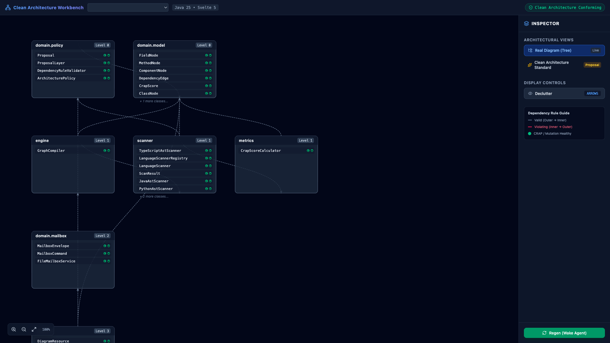
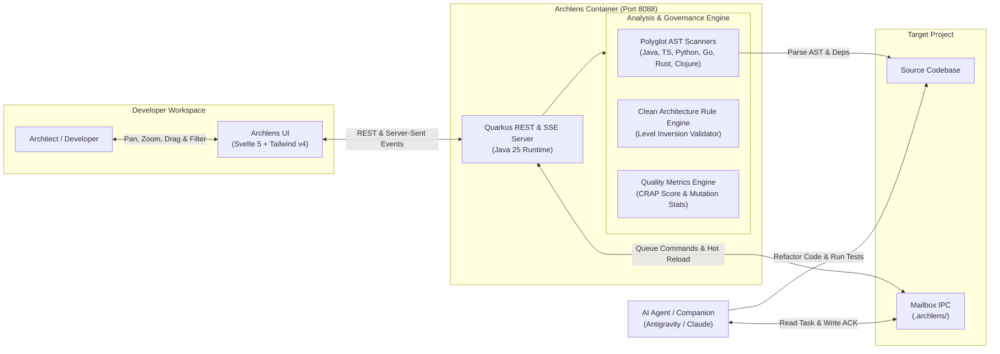
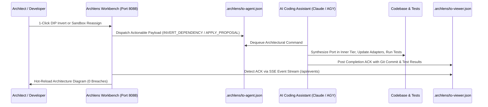

# Archlens — Dynamic Clean Architecture Workbench

[](https://github.com/fmatar/archlens/actions/workflows/ci.yml)
[](https://github.com/fmatar/archlens/actions/workflows/release.yml)
[](https://openjdk.org/)
[](https://quarkus.io/)
[](https://svelte.dev/)
[](Dockerfile)
[](#polyglot-language-support)
[](https://opensource.org/licenses/Apache-2.0)

> *"The Dependency Rule: Source code dependencies must point only inward, toward higher-level policies."*  
> — **Robert C. Martin (Uncle Bob)**

An interactive real-time architectural visualization workbench, polyglot Clean Architecture governance engine, and autonomous AI refactoring studio for modern software systems.

  
*(High Definition Video: [`media/archlens-teaser.mp4`](media/archlens-teaser.mp4) &bull; Extended Tour: [`media/archlens-user-journey.mp4`](media/archlens-user-journey.mp4) &bull; Animated Preview: [`media/archlens-teaser.gif`](media/archlens-teaser.gif))*

---

## ⚡ 3-Step Quickstart

Experience real-time Clean Architecture governance on any repository in three direct steps:

### 1. Equip Your Repository (Install Skills & Policy)

Scaffold architectural policies and agent refactoring protocols directly into your project:

```bash
# Production Stable Track (default)
npx @fmatar/archlens-skill

# Canary / Development Preview (tracks latest develop commits)
npx @fmatar/archlens-skill@dev

# Direct GitHub Execution (zero registry dependencies)
npx github:fmatar/archlens

# Non-interactive / headless setup accepting defaults
npx @fmatar/archlens-skill --yes

# Target a specific repository directory
npx @fmatar/archlens-skill --path /path/to/my-project --yes

# Export Clean Architecture LLM refactoring prompt dossier
npx @fmatar/archlens-skill prompt

# Copy dossier directly to system clipboard
npx @fmatar/archlens-skill prompt --copy
```

*Or install globally via npm:*
```bash
npm install -g @fmatar/archlens-skill
archlens-skill
```

*Or install from a local repository clone:*
```bash
npm install -g ./cli
archlens-skill
```

*Or instruct your AI assistant (Claude Code, Gemini CLI, Google Antigravity):*
> *"Install the Archlens Clean Architecture policy in this project."*

This creates:
- `.archlens/policy.json`: Concentric Clean Architecture tiers (Domain Core $\rightarrow$ Application $\rightarrow$ Adapters $\rightarrow$ Infrastructure).
- `.archlens/workbench.config.json`: Local workbench connection and mailbox configuration.
- `CLAUDE.md` & `AGENTS.md`: Mailbox refactoring protocols for autonomous coding companions.

---

### 2. Launch the Studio (1-Command Container Lifecycle)

Start the all-in-one container and visual workbench with a single command:

```bash
# Launch container and automatically open workbench in browser:
npx @fmatar/archlens-skill start --open

# Launch container in background on default port 8088:
npx @fmatar/archlens-skill start

# Specify custom workspace path or port:
npx @fmatar/archlens-skill start --path /path/to/my-project --port 8088 --open
```

> [!TIP]
> **Automatic Lifecycle & Auto-Resurrection**: `archlens-skill start` automatically checks whether the container (`archlens-server`) is running. If it is stopped, offline, or killed, it immediately starts it again on demand. Furthermore, any time an AI assistant calls an Archlens MCP tool, the container automatically resurrects without manual intervention.

*Alternatively, launch via Docker directly:*

```bash
# Production Stable
docker run -d --name archlens-server -p 8088:8088 \
  -v "$HOME/workspace:/workspace" \
  ghcr.io/fmatar/archlens:latest

# Canary / Development Track
docker run -d --name archlens-server -p 8088:8088 \
  -v "$HOME/workspace:/workspace" \
  ghcr.io/fmatar/archlens:dev
```

Open **`http://localhost:8088`** in your browser.

---

### 3. Inspect, X-Ray, Sandbox & Refactor

1. **Browse Projects (`⌘O` / `Ctrl+O`)**: Press `⌘O` to open the visual filesystem explorer. Select any repository mounted in `/workspace` with automatic build framework detection (`Maven`, `Gradle`, `Node`, `Go`, `Cargo`).
2. **Violation X-Ray (`V`)**: Press `V` to isolate illegal outward dependency violations in neon crimson while compliant inward flows gently fade into the background.
3. **Hierarchical Edge Bundling (`B`)**: Press `B` to route dense cross-package connections along smooth Catmull-Rom spline corridors.
4. **Git Release Comparator (`G`)**: Compare architecture against prior Git tags or pre-compiled snapshots with real-time delta badges (`+N breaches`, `✓N fixed`, `+N added`).
5. **Architectural Sandbox ("What-If" Prototyping) (`S`)**: Press `S` to enter sandbox simulation mode. Reassign classes between concentric rings without modifying a single line of disk code. Live-simulate package restructuring, see instantaneous violation deltas (`⚡ -N Violations`), inspect live Robert C. Martin coupling metrics, and dispatch proposals (`APPLY_PROPOSAL`) to AI agents.
6. **Robert C. Martin Coupling & Stability Engine**: Calculates Efferent Coupling ($C_e$), Afferent Coupling ($C_a$), Instability ($I = \frac{C_e}{C_a + C_e}$), Abstractness ($A$), and Normalized Distance from the Main Sequence ($D = |A + I - 1|$). Identifies components trapped in the *Zone of Pain* (rigid, unyielding) or *Zone of Uselessness* (abstract, unreferenced).
7. **Surgical DIP Inverter (`⚡`)**: Click any offending crimson edge or use the Inspector breach list to open the 1-click DIP Inverter. Automatically inspects class ASTs, extracts public caller methods, synthesizes clean interface ports in the inner tier, previews adapter implementations and caller injection refactors, and dispatches refactoring directives (`INVERT_DEPENDENCY`) directly to companion agents.
8. **LLM Prompt Export (`L`)**: Export a copy-ready Clean Architecture refactoring prompt dossier for LLMs to generate abstractions and invert inward dependencies.
9. **Wake Refactoring Agent (`Regen`)**: Click the green **Regen** action to post tasks into `.archlens/to-agent.json`. Your AI assistant applies the Dependency Inversion Principle, generates abstractions, runs tests, and triggers hot-reloads on the canvas.

---

### 4. Connect AI Assistants via Model Context Protocol (MCP)

Archlens embeds a native **Model Context Protocol (MCP)** server directly in its unified Quarkus backend over HTTP/SSE (`/mcp` and `/mcp/sse`), accompanied by an on-demand container runner and stdio bridge. AI coding assistants (Claude Desktop, Google Antigravity, Claude Code, Cursor, VS Code) can query Clean Architecture metrics and refactoring dossiers autonomously.

#### Automated 1-Command Setup:
```bash
# Auto-configures Claude Desktop, Google Antigravity, Claude Code, Cursor, and VS Code:
npx @fmatar/archlens-skill --mcp
```

#### Available Declarative Tools:
- `synthesizeDipInversion`: Synthesizes a targeted Dependency Inversion Principle (DIP) refactoring plan for any outward breach, generating the Java interface port code, adapter implementation diff, caller injection refactor, and step-by-step instructions.
- `inspectArchitecture`: Evaluates codebase concentric rings, computes instability metrics, and identifies outward dependency breaches.
- `exportLlmDossier`: Produces an actionable refactoring prompt dossier diagnosing violations and prescribing concrete Dependency Inversion Principle (DIP) interface ports.
- `listSnapshots`: Discovers pre-compiled snapshot files and historical Git release tags.
- `getSnapshot`: Retrieves architecture graph models for specific historical releases.

#### Manual AI Client Configurations:
- **Cursor & VS Code (`.cursor/mcp.json` or `.vscode/mcp.json`)**:
  ```json
  {
    "mcpServers": {
      "archlens": {
        "url": "http://localhost:8088/mcp/sse"
      }
    }
  }
  ```
- **Claude Desktop (`claude_desktop_config.json`) & Claude Code (`.mcp.json`)**:
  ```json
  {
    "mcpServers": {
      "archlens": {
        "command": "npx",
        "args": ["-y", "@fmatar/archlens-skill", "mcp"]
      }
    }
  }
  ```

---

## 🧭 Keyboard & Interaction Shortcuts

| Key | Action | Description |
| :--- | :--- | :--- |
| `⌘O` / `Ctrl+O` | **Project Switcher** | Open native folder browser to switch active repositories |
| `V` | **Violation X-Ray** | Toggle isolation of illicit outward dependency violations |
| `B` | **Edge Bundling** | Route connections along concentric Catmull-Rom spline corridors |
| `C` | **Compact Cards** | Collapse fine-grained class lists into high-level macro cards |
| `F` | **1-Hop Focus** | Isolate direct inbound and outbound dependencies for selected node |
| `P` | **Proposals** | Toggle between live architecture and hypothetical structural proposals |
| `S` | **Sandbox "What-If"** | Enter or exit interactive architectural sandbox simulation |
| `M` | **Main Sequence** | Toggle 2D Cartesian scatter plot of Abstractness ($A$) vs. Instability ($I$) |
| `L` | **LLM Prompt Dossier** | Export copy-ready Clean Architecture refactoring prompt for LLMs |
| `G` | **Release Comparator** | Compare architecture against Git tags and release snapshots |
| `⌘K` / `/` | **Command Palette** | Quick search classes, packages, and trigger workbench actions |
| `+` / `-` / `0` | **Zoom & Pan** | Zoom in, zoom out, or reset canvas viewport |

---

## 🌐 Polyglot Language Support

Archlens features a modular Service Provider Interface (SPI) for language scanners:

| Language | Ecosystem & AST Engine | File Extensions | Capabilities |
| :--- | :--- | :--- | :--- |
| **Java 25** | JavaParser 3.26 | `.java` | Records, Sealed Types, Interfaces, Class Hierarchies, Inward Rules |
| **Python** | Python AST Visitor | `.py` | Modules, Classes, Functions, Imports, Relative Imports |
| **TypeScript / JS** | Babel AST / Regex Scanner | `.ts`, `.tsx`, `.js`, `.jsx` | Classes, Interfaces, Named Imports, ESM Re-exports |
| **Rust** | Syn / Cargo AST Extractor | `.rs` | Structs, Traits, Impls, Module `use` Paths |
| **Go** | Go AST Tree Walker | `.go` | Structs, Interfaces, Package Imports, Type Definitions |
| **Clojure** | EDN & Regex AST Scanner | `.clj`, `.cljs`, `.edn` | Namespaces (`ns`), `(:require ...)`, `def`, `defn`, Protocols |

---

## 🏛️ System Architecture


```mermaid
flowchart LR
    subgraph Client ["Developer Workspace"]
        User["Architect / Developer"]
        Browser["Archlens UI<br/>(Svelte 5 + Tailwind v4)"]
    end

    subgraph Runtime ["Archlens Container (Port 8088)"]
        Server["Quarkus REST & SSE Server<br/>(Java 25 Runtime)"]
        
        subgraph Core ["Analysis & Governance Engine"]
            Scanner["Polyglot AST Scanners<br/>(Java, TS, Python, Go, Rust, Clojure)"]
            Rules["Clean Architecture Rule Engine<br/>(Level Inversion Validator)"]
            Metrics["Quality Metrics Engine<br/>(CRAP Score & Mutation Stats)"]
        end
    end

    subgraph Storage ["Target Project"]
        Code["Source Codebase"]
        Mailbox["Mailbox IPC<br/>(.archlens/)"]
    end

    Agent["AI Agent / Companion<br/>(Antigravity / Claude)"]

    User <-->|Pan, Zoom, Drag & Filter| Browser
    Browser <-->|REST & Server-Sent Events| Server
    Server --> Core
    Scanner -->|Parse AST & Deps| Code
    Server <-->|Queue Commands & Hot Reload| Mailbox
    Agent <-->|Read Task & Write ACK| Mailbox
    Agent -->|Refactor Code & Run Tests| Code
```

---

## 🤖 AI Agent Mailbox Protocol (IPC)

Archlens provides seamless bidirectional integration with autonomous coding companions (Claude Code, Google Antigravity, Gemini CLI, Cursor, Windsurf) through a structured file-based Mailbox IPC (`.archlens/to-agent.json` and `.archlens/to-viewer.json`):


```mermaid
sequenceDiagram
    participant User as Architect / Developer
    participant UI as Archlens Workbench (Port 8088)
    participant Inbox as .archlens/to-agent.json
    participant Agent as AI Coding Assistant (Claude / AGY)
    participant Code as Codebase & Tests
    participant Outbox as .archlens/to-viewer.json

    User->>UI: 1-Click DIP Invert or Sandbox Reassign
    UI->>Inbox: Dispatch Actionable Payload (INVERT_DEPENDENCY / APPLY_PROPOSAL)
    Agent->>Inbox: Dequeue Architectural Command
    Agent->>Code: Synthesize Port in Inner Tier, Update Adapters, Run Tests
    Agent->>Outbox: Post Completion ACK with Git Commit & Test Results
    UI->>Outbox: Detect ACK via SSE Event Stream (/api/events)
    UI->>User: Hot-Reload Architecture Diagram (0 Breaches)
```

### Supported Mailbox Commands:
- **`INVERT_DEPENDENCY`**: Dispatches the complete DIP synthesizer payload (`portName`, `portPackage`, `portInterfaceCode`, `sourceClass`, `targetClass`). The agent creates the interface port in the inner layer, updates the concrete adapter, refactors the caller to inject the port, runs tests, and acknowledges completion.
- **`APPLY_PROPOSAL`**: Dispatches a full sandbox "what-if" architectural proposal (`proposalId`, `stagedClassMoves`). The agent relocates classes across concentric package rings and executes test suites.
- **`REGEN`**: Signals the agent to re-scan the codebase AST, evaluate inward dependency rules, and verify architectural invariants.
- **`REFRESH_CRAP`**: Triggers execution of mutation testing (PITest / Stryker) and JaCoCo coverage to refresh complexity and risk metrics.

---

## 🛠️ CLI Reference (`@fmatar/archlens-skill`)

| Flag | Shorthand | Description | Default |
| :--- | :--- | :--- | :--- |
| `start` | | Start Archlens Workbench container (auto-resurrects on demand) | |
| `--open` | `-o` | Open visual workbench in default browser upon startup | `false` |
| `--port <PORT>` | | Workbench HTTP port | `8088` |
| `--path <DIR>` | `-p` | Target repository directory | `.` (current directory) |
| `--title <NAME>` | `-t` | Project title in visual workbench | Formatted folder name |
| `--prefix <PKG>` | | Common package prefix (e.g. `com.example.service`) | Auto-detected |
| `--server-url <URL>` | | Visual Workbench server endpoint | `http://localhost:8088` |
| `--mcp` | `-m` | Auto-configure MCP client manifests (Claude, Antigravity, Cursor) | `false` |
| `--copy` | `-c` | Copy LLM prompt output directly to system clipboard | `false` |
| `--global` | `-g` | Install skill into global agent directories | `false` |
| `--update` | `-u` | Re-scan code and update existing policy | `false` |
| `--upgrade` | | Migrate legacy `.uml-viewer` to standard `.archlens` | `false` |
| `--force` | `-f` | Overwrite existing configuration files | `false` |
| `--dry-run` | | Simulate execution without writing files | `false` |
| `--yes` | `-y` | Accept defaults automatically (non-interactive) | `false` |
| `--version` | `-v` | Display package version | |
| `--help` | `-h` | Display help reference | |

---

## 💡 The Vision & Inspiration

Robert C. Martin’s writings have been a foundational reference point throughout modern software engineering. *Clean Code*, *Clean Architecture*, and the SOLID principles established how we protect core business policies from the volatility of frameworks, delivery mechanisms, and external databases.

When Uncle Bob open-sourced [unclebob/uml-viewer](https://github.com/unclebob/uml-viewer), the vision was captivating: transforming the Dependency Rule from an abstract diagram in a book into a living, tangible feedback loop right on our screens. Seeing that experimental prototype sparked an immediate ambition: bring this exact philosophy into modern polyglot enterprise environments.

Archlens takes Uncle Bob's core thesis and expands it into a comprehensive architecture governance and refactoring workbench supporting six languages, hierarchical edge routing, and autonomous agent collaboration.

---

## 💻 Building from Source

For developers wishing to build and test Archlens locally:

### Prerequisites
- Java 25 (OpenJDK / GraalVM)
- Apache Maven 3.9+
- Node.js 22+ and npm

```bash
# 1. Start the Backend
cd backend
./mvnw clean quarkus:dev

# 2. Start the Frontend
cd ../frontend
npm install
npm run dev

# 3. Run Quality Verification & Tests
mvn clean verify
npm --prefix frontend run check
npm --prefix frontend run test
npm --prefix frontend run test:e2e
```

---

## 📚 Documentation & Resources
 
- **[Archlens GitHub Wiki](https://github.com/fmatar/archlens/wiki)** *(Complete architectural guides & deep-dives)*
  - [Surgical DIP Inverter Guide](https://github.com/fmatar/archlens/wiki/Surgical-DIP-Inverter)
  - [Architectural Sandbox & What-If Simulation](https://github.com/fmatar/archlens/wiki/Architectural-Sandbox)
  - [Robert C. Martin Coupling & Stability Metrics](https://github.com/fmatar/archlens/wiki/Robert-C-Martin-Metrics)
  - [Model Context Protocol (MCP) Integration](https://github.com/fmatar/archlens/wiki/MCP-Integration)
  - [Mailbox IPC Companion Protocol](https://github.com/fmatar/archlens/wiki/Mailbox-IPC)
- [User Guide](docs/guide/USER_GUIDE.md)
- [Developer & Contributor Guide](docs/guide/DEVELOPER_GUIDE.md)
- [C4 Architecture Specification](docs/specs/C4_ARCHITECTURE.md)
- [Inspiration & Vision](docs/guide/INSPIRATION_AND_VISION.md)
- [SDLC Compliance Report](docs/specs/SDLC_COMPLIANCE_REPORT.md)
- [Changelog](CHANGELOG.md)
- [Contribution Process](CONTRIBUTING.md)

---

## 📄 License

Licensed under the [Apache License, Version 2.0](LICENSE).  
See the [NOTICE](NOTICE) file for attribution and acknowledgements.
