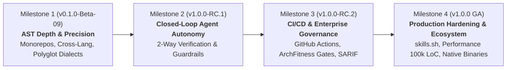

# 🗺️ Archlens Product Roadmap (v0.1.0-Beta $\to$ v1.0.0 GA)

An engineering roadmap outlining the strategic milestones, technical deliverables, and architectural criteria required to advance **Archlens (Dynamic Clean Architecture Workbench)** from Beta to an enterprise-grade **v1.0.0 General Availability (GA)** release.

---

## 🧭 Milestone Architecture



---

## 🎯 Milestones & Traceability

### [Milestone 1: AST Depth & Polyglot Scalability (v0.1.0-Beta-09)](https://github.com/fmatar/archlens/milestone/1)
*Focus: Ensuring AST parsing never breaks on complex enterprise architectures, monorepos, and hybrid language setups.*

- **Linked Epic**: [#163 Epic: Enterprise Monorepos, Multi-Module Scanners & Cross-Lang AST Tracing](https://github.com/fmatar/archlens/issues/163)
- **Key Deliverables**:
  1. **Enterprise Monorepo & Multi-Module Scanners**:
     - Deep nested Maven multi-modules, Gradle subprojects, Nx/Turborepo workspaces, and Cargo workspaces.
     - Cross-project boundary detection: distinguishing between internal intra-monorepo imports vs external 3rd-party dependencies.
  2. **Cross-Language Boundary Tracing**:
     - Bridge frontend API client calls (Svelte 5 / TS fetch / axios) to backend entrypoints (Quarkus REST / SSE / FastAPI).
  3. **AST Parser Resiliency & Fault Tolerance**:
     - Graceful partial AST degradation: if a single source file has syntax errors during active editing, the scanner isolates that file rather than breaking the canvas graph.
     - Modern syntax idioms: Java 25 pattern matching, Go 1.23 iterators, Python 3.12 type aliases.

---

### [Milestone 2: Closed-Loop Agent Autonomy & Guardrails (v1.0.0-RC.1)](https://github.com/fmatar/archlens/milestone/2)
*Focus: Elevating AI agent collaboration from one-off command dispatching into a bulletproof, verifiable pair-architect workflow.*

- **Linked Epic**: [#164 Epic: Transactional Worktree Rollbacks & Automated Mailbox Refactoring Verification](https://github.com/fmatar/archlens/issues/164)
- **Key Deliverables**:
  1. **Transactional "What-If" Rollback & Git Staging Isolation**:
     - Execute agent refactoring directives (`APPLY_PROPOSAL`, `INVERT_DEPENDENCY`) in dedicated Git worktrees with pre/post refactor snapshots.
     - 1-click "Revert Agent Changes" button on the canvas if changes fail validation.
  2. **Automated Verification Gate (`VERIFY_REFACTOR`)**:
     - Archlens backend automatically re-indexes AST and runs test suites to mathematically verify that the violation delta decreased ($\Delta - N$) before acknowledging completion (`to-viewer.json`).
  3. **Dual-Agent Architectural Intent & Human Directives**:
     - Attach architectural intent notes and architectural constraints directly into the mailbox payload.

---

### [Milestone 3: CI/CD Quality Gates & Team Governance (v1.0.0-RC.2)](https://github.com/fmatar/archlens/milestone/3)
*Focus: Shifting Archlens from a local developer studio into an enforceable team standard.*

- **Linked Epic**: [#165 Epic: Archlens Headless GitHub Action, SARIF PR Annotations & Living ADR Sync](https://github.com/fmatar/archlens/issues/165)
- **Key Deliverables**:
  1. **Archlens Headless GitHub Action (`fmatar/archlens-action@v1`)**:
     - Official GitHub Action executing headless architectural audits in CI workflows.
     - Enforces Uncle Bob's ADP (Acyclic Dependencies Principle), maximum outward breach limits, and minimum Screaming Architecture Scores (SAS).
  2. **First-Class Pull Request Annotations (SARIF / GitHub Checks)**:
     - Inline PR diff annotations flagging illegal outward dependency breaches directly in GitHub Code Review.
  3. **Automated Architecture Decision Records (ADR) Sync**:
     - Automated generation and updating of living ADR markdown files in `docs/adr/` whenever a DIP inversion or Sandbox package move is approved.
  4. **Historical Architecture Fitness Timelines**:
     - Visualizing architectural drift and stability metrics across Git release tags over time.

---

### [Milestone 4: Production Hardening, Distribution & Ecosystem (v1.0.0 GA)](https://github.com/fmatar/archlens/milestone/4)
*Focus: Community distribution, extreme performance, zero friction, and comprehensive documentation.*

- **Linked Epic**: [#166 Epic: v1.0.0 GA Production Hardening, skills.sh Ecosystem & 100k LoC Virtualization](https://github.com/fmatar/archlens/issues/166)
- **Key Deliverables**:
  1. **Ecosystem & Distribution**:
     - Official indexing and verification on **[skills.sh](https://skills.sh)** via `vercel-labs/skills` (`npx skills add fmatar/archlens`).
     - GraalVM native single-binary distribution eliminating JVM & Docker runtime requirements.
     - Multi-arch Docker images (`linux/amd64`, `linux/arm64`) on Docker Hub and GHCR.
  2. **Canvas Performance & Virtualization at Scale (100k+ LoC)**:
     - Virtualized SVG / Canvas WebGL hybrid rendering when graphs exceed 500+ classes.
     - Level-of-Detail (LoD) semantic zooming: automatically collapsing class details into package clusters when zooming out, expanding on zoom-in.
  3. **Public Interactive Showcase**:
     - Live web-based playground / demo on `archlens.io` pre-loaded with famous open-source architectural patterns (e.g. Spring PetClinic, Quarkus Quickstarts, RealWorld spec).

---

## 📊 Living Kanban Board

Track real-time progress across all epics, milestones, and issues in [`docs/KANBAN.md`](docs/KANBAN.md).
To synchronize the board at any time:
```bash
.agents/skills/sdlc-kanban/scripts/kanban-sync.sh
```
