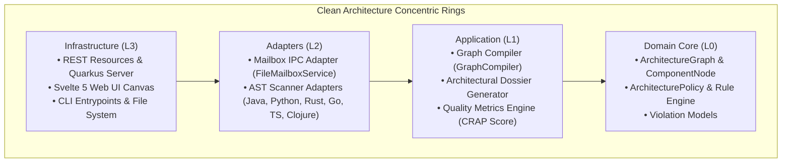

# Archlens Developer & Contributor Guide

Welcome to the **Archlens** developer community! This comprehensive guide provides everything required to understand the codebase, set up your local development environment, build and test each module, implement new polyglot language scanners, extend the Model Context Protocol (MCP) server, and contribute adhering to Robert C. Martin (Uncle Bob) craftsmanship standards.

---

## 🏛️ 1. Architecture & Core Philosophy

Archlens is engineered around **Clean Architecture** and the **Dependency Inversion Principle (DIP)**:

> *"Source code dependencies must point only inward, toward higher-level policies."*  
> — **Robert C. Martin (Uncle Bob)**



### The Inward Dependency Rule:
- **Domain Core (L0)**: Contains immutable models (`ArchitectureGraph`, `ComponentNode`, `ArchitecturePolicy`). Contains zero dependencies on outer frameworks or scanners.
- **Application (L1)**: Orchestrates graph compilation, evaluates directional package imports against ring policies, and generates refactoring prompt dossiers.
- **Adapters (L2)**: Implements language scanner SPIs, AST walkers, and file mailbox communication queues.
- **Infrastructure (L3)**: Exposes HTTP/REST APIs, Server-Sent Events (SSE), native MCP endpoints, and renders the interactive browser canvas.

---

## 📁 2. Monorepo Organization

```text
archlens/
├── backend/                  # Quarkus 3.x Java 25 Application
│   ├── src/main/java/        # Polyglot Scanners, Graph Compiler, MCP Service, REST Resources
│   ├── src/main/resources/   # Application properties, SpotBugs exclusions, PMD rule configurations
│   ├── src/test/java/        # Unit & architecture verification test suites
│   └── pom.xml               # Backend Maven configuration
├── frontend/                 # Svelte 5 + Tailwind CSS v4 Interactive Canvas
│   ├── src/lib/components/   # Component cards, edges, modals, comparator, command palette
│   ├── src/lib/state/        # Svelte 5 runes ($state, $derived) store management
│   ├── src/lib/utils/        # D3 force layout algorithms, Catmull-Rom splines, GSAP helpers
│   ├── package.json          # Frontend dependencies and Vite scripts
│   └── vitest.config.ts      # Vitest component and store testing configuration
├── cli/                      # Zero-Dependency Multi-Agent Skill & MCP Installer
│   ├── bin/index.js          # CLI entrypoint (archlens-skill, archlens-init)
│   ├── src/analyzer.js       # Lightweight offline AST classifier & dossier generator
│   ├── src/installer.js      # Policy scaffolder and companion guideline injector
│   ├── src/mcp-registry.js   # Host AI client manifest registry (Claude, Antigravity, Cursor)
│   ├── src/mcp-server.js     # JSON-RPC 2.0 stdio MCP bridge server
│   ├── src/docker-runner.js  # On-demand container runner & health checker
│   └── test/                 # Node native test runner suite
├── docs/                     # Specifications, User Guides, C4 Architecture, and Inspiration
├── .archlens/                # Active repository governance policy and mailbox IPC queue
└── pom.xml                   # Root reactor POM aggregating backend and packaging
```

---

## 🛠️ 3. Toolchain & Prerequisites

Ensure the following tools are installed on your workstation:

| Tool | Minimum Version | Recommended | Notes |
| :--- | :--- | :--- | :--- |
| **Java** | OpenJDK 21 | OpenJDK 25 / GraalVM 25 | Required for records, pattern matching, and backend compilation |
| **Maven** | 3.9.0 | 3.9.9+ | Primary backend build orchestrator |
| **Node.js** | 20.0.0 | 22.0.0+ | Required for frontend tooling and CLI execution |
| **pnpm** | 9.0.0 | Latest | Recommended package manager for frontend dependencies |
| **Docker** | 24.0.0 | Latest | Optional; required for container packaging and runtime tests |

---

## 🚀 4. Local Development Workflows

### Workflow A: Full-Stack Dev Mode (Recommended)

Run the backend and frontend simultaneously with live hot-reloading:

```bash
# Terminal 1: Launch Quarkus Backend (Port 8088)
cd backend
./mvnw quarkus:dev

# Terminal 2: Launch Svelte 5 Frontend (Port 5173)
cd frontend
pnpm install
pnpm dev
```

Open **`http://localhost:5173`** in your browser.  
Vite automatically proxies `/api` and `/mcp` requests to the Quarkus backend on port `8088`. Changes to Java sources, Svelte components, or Tailwind styles reload immediately.

---

### Workflow B: Standalone Backend Development

To verify, package, or execute backend unit tests:

```bash
cd backend

# Execute all 61 tests
mvn test

# Execute Spotless code format check
mvn spotless:check

# Auto-apply Spotless formatting
mvn spotless:apply

# Execute PMD static analysis
mvn pmd:check

# Execute SpotBugs security analysis
mvn compile spotbugs:check

# Package the runnable Quarkus application
mvn package -DskipTests
```

The compiled runnable jar is placed at `backend/target/quarkus-app/quarkus-run.jar`. Run it directly via:
```bash
java -jar backend/target/quarkus-app/quarkus-run.jar
```

---

### Workflow C: CLI Development (`@fmatar/archlens-skill`)

The CLI is engineered with zero external production dependencies using pure Node.js standard libraries:

```bash
cd cli

# Execute all CLI unit tests using Node's native test runner
npm test

# Test the CLI locally without installing
node bin/index.js --help

# Test MCP client discovery and manifest generation in dry-run mode
node bin/index.js --mcp --dry-run

# Test MCP stdio server with JSON-RPC initialize command
printf '{"jsonrpc":"2.0","id":1,"method":"initialize","params":{"protocolVersion":"2024-11-05"}}\n' | node bin/index.js mcp
```

Install your local CLI development build globally:
```bash
npm install -g ./cli
archlens-skill --version
```

---

### Workflow D: Safe Dependency Governance & Maintenance

To keep the monorepo secure and modern without sacrificing build determinism:

```bash
# Audit dependencies across Maven and NPM without modifying files
npm run deps:check

# Safely upgrade dependencies to verified stable GA releases and run full Dual-Gate verification
npm run deps:update

# Explore major version upgrades with full Dual-Gate verification and automated rollback
npm run deps:update:major
```

If any verification test fails during an update, the engine immediately rolls back all manifest changes to preserve a clean git state.

---

## 🧩 5. How to Add a New Polyglot Language Scanner

Archlens uses a Service Provider Interface (SPI) design for language scanners. Follow this four-step recipe to add support for a new language (e.g. Swift, C#, Scala, Ruby):

### Step 1: Implement `LanguageScanner`
Create `backend/src/main/java/com/design/umlviewer/scanner/<Language>AstScanner.java`:

```java
package com.design.umlviewer.scanner;

import com.design.umlviewer.domain.model.ComponentNode;
import com.design.umlviewer.domain.model.DependencyEdge;
import com.design.umlviewer.domain.policy.ArchitecturePolicy;
import jakarta.enterprise.context.ApplicationScoped;
import java.io.File;
import java.io.IOException;
import java.util.List;

@ApplicationScoped
public class SwiftAstScanner implements LanguageScanner {

  @Override
  public String language() {
    return "swift";
  }

  @Override
  public boolean canScan(File projectRoot) {
    return new File(projectRoot, "Package.swift").exists() 
        || FileScannerUtil.hasFilesWithExtension(projectRoot, ".swift");
  }

  @Override
  public ScanResult scan(File projectRoot, ArchitecturePolicy policy) throws IOException {
    List<File> sourceFiles = FileScannerUtil.findFiles(projectRoot, ".swift");
    
    // Parse files, extract types and outward import statements
    // ...
    
    return new ScanResult(nodes, edges);
  }
}
```

### Step 2: Register in `LanguageScannerRegistry`
Register the scanner inside `backend/src/main/java/com/design/umlviewer/scanner/LanguageScannerRegistry.java`:

```java
@Inject SwiftAstScanner swiftScanner;

@PostConstruct
void init() {
  scanners.add(javaScanner);
  scanners.add(pythonScanner);
  scanners.add(typeScriptScanner);
  scanners.add(rustScanner);
  scanners.add(goScanner);
  scanners.add(clojureScanner);
  scanners.add(swiftScanner); // Added scanner
}
```

### Step 3: Utilize `FileScannerUtil` for Fault-Tolerant Traversal
Always traverse source files using `FileScannerUtil.findFiles(...)`. This automatically skips hidden folders (`.git`, `.archlens`), dependency directories (`node_modules`, `target`, `.build`), Unix sockets, and unreadable files.

### Step 4: Add Comprehensive Tests
Create `backend/src/test/java/com/design/umlviewer/scanner/<Language>AstScannerTest.java`:
- Provide realistic source file fixtures in `@TempDir`.
- Verify extracted components, inner layer classifications, and outward dependencies.
- Ensure 100% test pass rate with meaningful domain assertions.

---

## 🤖 6. How to Extend the Model Context Protocol (MCP) Server

Archlens exposes native MCP capabilities directly from Quarkus using `quarkus-mcp-server-http`.

### Step 1: Add a Tool Method
In `backend/src/main/java/com/design/umlviewer/mcp/ArchlensMcpService.java`, declare your tool using `@Tool` and `@ToolArg`:

```java
@Tool(description = "Verify compliance of a specific component against Clean Architecture boundaries.")
public ComplianceReport checkComponent(
    @ToolArg(description = "Target component name") String componentName,
    @ToolArg(description = "Absolute or relative path to project root", defaultValue = ".") String projectRoot) 
    throws IOException {
  return diagramResource.checkComponentCompliance(componentName, projectRoot);
}
```

### Step 2: Update the CLI Manifest Registry
Add the tool's parameter definition to `cli/src/mcp-registry.js` under `ARCHLENS_TOOL_SCHEMAS`:

```javascript
checkComponent: {
  name: 'checkComponent',
  description: 'Verify compliance of a specific component against Clean Architecture boundaries.',
  parameters: {
    type: 'object',
    properties: {
      componentName: { type: 'string', description: 'Target component name' },
      projectRoot: { type: 'string', description: 'Path to project directory', default: '.' }
    },
    required: ['componentName']
  }
}
```

### Step 3: Implement Offline Fallback in `mcp-server.js`
In `cli/src/mcp-server.js`, handle the tool execution in `executeToolCall(...)` so AI agents receive accurate static responses even when Docker or the Quarkus server is offline.

---

## 🧪 7. Quality Standards & Verification Matrix

Every pull request must pass all quality gates cleanly without warnings:

| Quality Gate | Command | Passing Standard |
| :--- | :--- | :--- |
| **Spotless Code Formatting** | `mvn spotless:check` | 0 formatting discrepancies |
| **Spotless Auto-Fix** | `mvn spotless:apply` | Formats all modified Java files |
| **PMD Static Analysis** | `mvn pmd:check` | 0 violations (`failOnViolation=true`) |
| **SpotBugs Analysis** | `mvn compile spotbugs:check` | 0 bugs (`threshold=Low`, `effort=Max`) |
| **Backend Unit Tests** | `mvn test` | 100% passing tests (61+ tests) |
| **CLI Test Suite** | `npm --prefix cli test` | 100% passing tests (43+ tests) |
| **Frontend Unit Tests** | `npm --prefix frontend test` | 100% passing Vitest tests (25+ tests) |
| **Frontend Type Checking** | `npm --prefix frontend run check` | 0 TypeScript or Svelte errors |

---

## 🎯 8. Uncle Bob Test Craftsmanship Standards

To maintain clean code and protect against regression without brittle tests, adhere to these principles:

1. **State-Based Verification Over Mock Abuse**:
   - Prefer anonymous domain fakes or real test fixtures over mock interaction assertions (`verify(x).someMethod()`).
   - Test observable behavior and return values rather than internal execution mechanics.
2. **Zero Trivial Assertions**:
   - Every test must validate actual business invariants, ring boundaries, or error paths.
3. **Dual-Gate Testing Goals**:
   - Aim for $\ge 85\%$ line and branch coverage on new logic.
   - Aim for $\ge 80\%$ mutation kill score. Tests should catch deliberate faults in production code.

---

## 🌿 9. Git Workflow & Submitting Pull Requests

1. **Branching Strategy**:
   - Always branch off `develop`.
   - Branch naming format: `feat/issue-<id>-<short-description>`, `fix/issue-<id>-<short-description>`, or `docs/issue-<id>-<short-description>`.
2. **Conventional Commits**:
   Follow conventional commit messages:
   - `feat(scanner): add Swift language scanner`
   - `fix(canvas): resolve edge tooltip lingering on hover leave`
   - `docs(guide): update developer guide with MCP instructions`
   - `refactor(mcp): sanitize snapshot identifiers against traversal`
3. **Pull Request Checklist**:
   - [ ] Targeted against `develop`.
   - [ ] Issue referenced in summary (`Closes #<id>`).
   - [ ] All automated checks pass (`mvn clean verify`, `npm --prefix cli test`, `npm --prefix frontend test`).
   - [ ] `CHANGELOG.md` updated under `[Unreleased]`.
   - [ ] Documentation updated to reflect changes.
