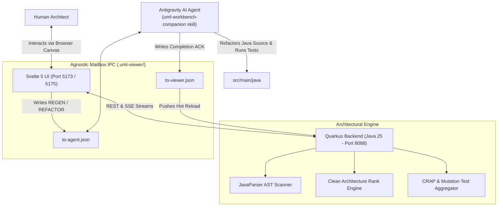

# Clean Architecture Dynamic UML Workbench: Comprehensive Guide

Welcome to the **Clean Architecture Dynamic UML Workbench**. This system bridges high-level architectural design with physical Java source code, enabling architects and developers to visually supervise, explore, and direct AI coding agents.

---

## 1. System Architecture Overview



---

## 2. Launching the Workbench

### Step 1: Start the Quarkus Backend (Java 25)
Open your terminal:

```bash
cd backend
mvn clean quarkus:dev
```
* **Port**: Runs on **`http://localhost:8088`** (configured to avoid Docker port 8080 conflicts).
* **Responsibilities**: Analyzes the Java AST, enforces Clean Architecture levels, and watches the `.uml-viewer/` mailbox.

### Step 2: Start the Svelte 5 Frontend
In a separate terminal:

```bash
cd frontend
npm run dev
```
* Open **`http://localhost:5173`** (or the port Vite provides) in your browser.

---

## 3. How to Use the Visual Workbench

### Canvas & Box Controls
- **Reposition Any Box**: Click and drag the **top title banner** of any component box to move it anywhere on the canvas.
- **Pan the Entire Canvas**: Click and hold any open dark background and drag.
- **Zoom**: Scroll your mouse wheel or use the `+`, `-`, and `100%` buttons at the bottom-left.

### Clean Architecture Dependency Rules
Uncle Bob's Clean Architecture dictates that **source code dependencies must point inward**:
- **Level 0 (Domain Core)**: Innermost business rules.
- **Level 1 (Application Services)**: Use cases and orchestration.
- **Level 2 (Infrastructure & Adapters)**: REST endpoints, databases, UI, and external libraries.

**Visual Guide**:
* **Solid Grey Curves**: Conforming dependencies (outer layer $\rightarrow$ inner layer, or same layer).
* **Bold Red Curves**: Illegal violations (an inner layer directly importing or calling an outer layer).
* **Top Status Badge**: Displays `[Clean Architecture Conforming]` or `[N Dependency Rule Violations]`.

### Playing "What-If" Proposals (Virtual Sandbox)
In the right-hand **Inspector**:
1. Select **`Real Diagram (Tree)`** to view your actual Java package structure.
2. Click **`Decoupled Clean Core`**:
   - The yellow badge appears: `PROPOSAL — not instantiated in code`.
   - The dependency engine immediately recalculates all arrows based on the proposed groupings.
   - Any violating dependencies turn **bold red**.
   - You can evaluate whether an architectural design is sound **before** moving any files or writing code.

### Inspecting Class Details & Quality Metrics
Click on any class name (e.g. `ClassNode` or `DependencyRuleValidator`) inside a box:
- Displays **Stereotype** (`«RECORD»`, `«CLASS»`, `«INTERFACE»`).
- Displays **CRAP score** ($\text{CRAP} = CC^2 \cdot (1 - \text{Cov})^3 + CC$), **Line Coverage**, and **Mutation testing stats** (killed vs survived mutants).
- Lists all fields and methods with individual Cyclomatic Complexity (`CC`).
- Click **View Source Code** to open the in-browser viewer and jump directly to that method's line of code.

### Declutter Modes
Click the **`Declutter`** button in the Inspector to cycle through:
- `ARROWS`: Directional curves between related layers.
- `REMOVE_ARROWS`: Replaces lines with directional triangle badges on boxes to keep large diagrams clean.
- `CLASSES`: Collapses components into clean layer boxes.
- `NONE`: Shows raw topology.

---

## 4. Connecting Antigravity via the Skill

The workbench is decoupled from any proprietary AI agent. It communicates through durable JSON files in `.uml-viewer/`:

1. **The Skill**: Installed in [`.agents/skills/uml-workbench-companion/SKILL.md`](file:///Users/fady/workspace/labs/unclebob-design/.agents/skills/uml-workbench-companion/SKILL.md).
2. **Triggering Antigravity**:
   - In the UI, click **`Regen (Wake Agent)`**.
   - The UI writes a `REGEN` or `APPLY_PROPOSAL` command to `.uml-viewer/to-agent.json`.
   - In Antigravity chat, tell the agent:
     > *"Check for pending workbench commands and process them."*
   - Antigravity activates the `uml-workbench-companion` skill, refactors the Java classes to eliminate red violations, runs `mvn test`, and writes `REGEN_COMPLETE` to `.uml-viewer/to-viewer.json`.
   - The diagram immediately updates on your screen.
