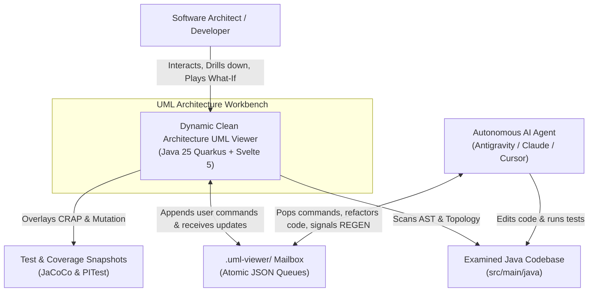
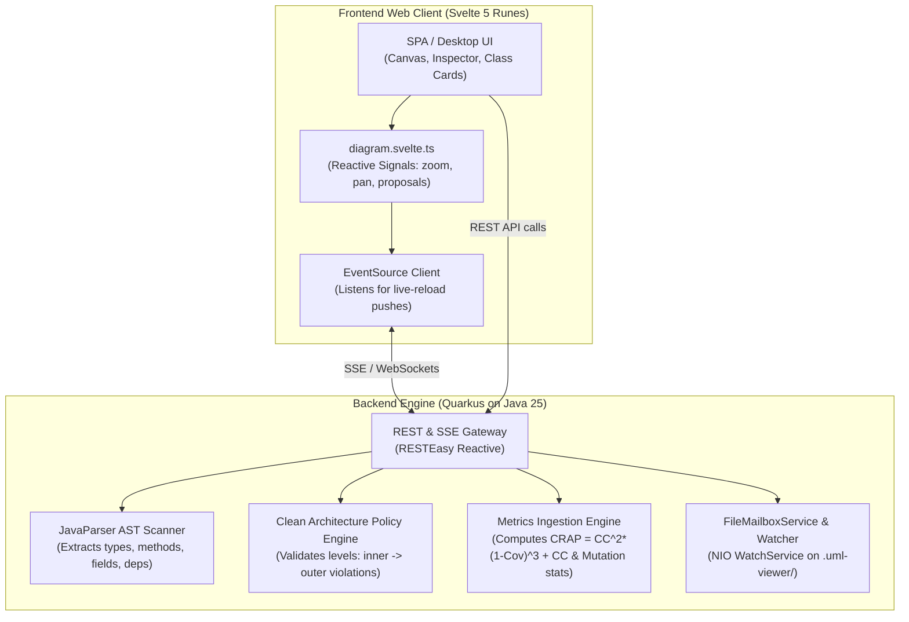

# C4 Architecture Specification: Clean Architecture Dynamic UML Viewer

## 1. Context Diagram

## 2. Container Diagram

## 3. Component Contract & Domain Model

- **`ClassNode`**: Record representing a compiled Java type with its stereotype (`CLASS`, `INTERFACE`, `RECORD`, `ENUM`), package name, fields, and method metrics.
- **`ComponentNode`**: Hierarchical namespace/package grouping with computed health scores (CRAP μ, max, σ, and Mutation killed/survived ratios).
- **`DependencyEdge`**: Edge connecting two nodes (`from`, `to`, `kind`, `isViolating`).
- **`DependencyRuleValidator`**: Verifies that inner layers (lower numerical rank, e.g. Domain = 0) do not depend on outer layers (higher rank, e.g. Adapters = 2).
