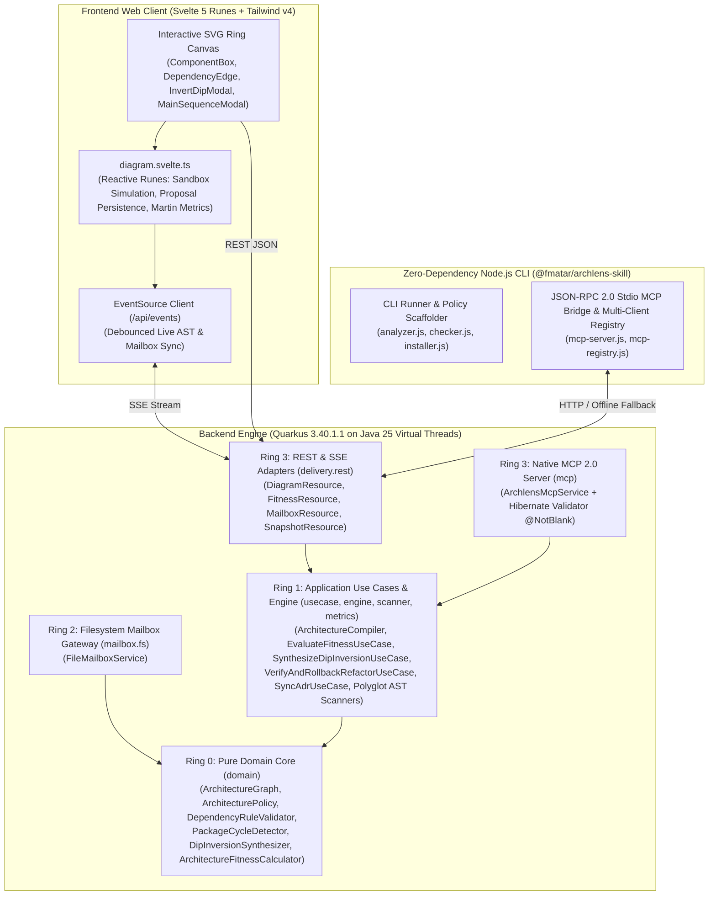

# C4 Architecture Specification: Archlens Dynamic Clean Architecture Workbench

## 1. System Context Diagram (C4 Level 1)

```mermaid
flowchart TD
    User["Software Architect / Engineer"]
    Agent["Autonomous AI Coding Agent\n(Antigravity, Gemini CLI, Claude Code, Grok, Cursor, Windsurf)"]
    
    subgraph System ["Archlens Governance & Refactoring Workbench (v0.1.1)"]
        App["Archlens Dynamic Workbench\n(Quarkus 3.40.1.1 on Java 25 + Svelte 5 + @fmatar/archlens-skill CLI)"]
    end
    
    TargetCode["Polyglot Target Codebase\n(Java 25, Python, TS/JS/Svelte 5, Rust, Go, Clojure)"]
    PolicyAndMailbox[".archlens/ Governance & IPC\n(policy.json, to-agent.json, to-viewer.json, snapshots/)"]
    AdrDocs["Living Architectural Lineage\n(docs/adr/ADR-*.md & SARIF Reports)"]

    User -->|Inspects Rings, Simulates in Sandbox, Dispatches Directives| App
    App -->|Scans Polyglot ASTs & Evaluates Concentric Invariants| TargetCode
    App <-->|Reads/Persists Policy, Snapshots & Mailbox IPC| PolicyAndMailbox
    Agent <-->|Queries 10 MCP Tools, 3 Resources & 2 Prompts (/mcp, /mcp/sse, stdio)| App
    Agent <-->|Dequeues Directives & Posts Verification ACKs| PolicyAndMailbox
    Agent -->|Synthesizes DIP Ports, Reorganizes Packages & Runs Tests| TargetCode
    App -->|Mints Living ADRs & Exports SARIF 2.1.0| AdrDocs
```

---

## 2. Container Diagram (C4 Level 2)

```mermaid
flowchart TD
    subgraph FrontendContainer ["Frontend Web Client (Svelte 5 Runes + Tailwind v4)"]
        UI["Interactive SVG Ring Canvas\n(ComponentBox, DependencyEdge, InvertDipModal, MainSequenceModal)"]
        State["diagram.svelte.ts\n(Reactive Runes: Sandbox Simulation, Proposal Persistence, Martin Metrics)"]
        SSEListener["EventSource Client (/api/events)\n(Debounced Live AST & Mailbox Sync)"]
    end

    subgraph CliContainer ["Zero-Dependency Node.js CLI (@fmatar/archlens-skill)"]
        CliBin["CLI Runner & Policy Scaffolder\n(analyzer.js, checker.js, installer.js)"]
        McpStdio["JSON-RPC 2.0 Stdio MCP Bridge & Multi-Client Registry\n(mcp-server.js, mcp-registry.js)"]
    end

    subgraph BackendContainer ["Backend Engine (Quarkus 3.40.1.1 on Java 25 Virtual Threads)"]
        RestDelivery["Ring 3: REST & SSE Adapters (delivery.rest)\n(DiagramResource, FitnessResource, MailboxResource, SnapshotResource)"]
        McpDelivery["Ring 3: Native MCP 2.0 Server (mcp)\n(ArchlensMcpService + Hibernate Validator @NotBlank)"]
        MailboxAdapter["Ring 2: Filesystem Mailbox Gateway (mailbox.fs)\n(FileMailboxService)"]
        UseCases["Ring 1: Application Use Cases & Engine (usecase, engine, scanner, metrics)\n(ArchitectureCompiler, EvaluateFitnessUseCase, SynthesizeDipInversionUseCase,\nVerifyAndRollbackRefactorUseCase, SyncAdrUseCase, Polyglot AST Scanners)"]
        DomainCore["Ring 0: Pure Domain Core (domain)\n(ArchitectureGraph, ArchitecturePolicy, DependencyRuleValidator,\nPackageCycleDetector, DipInversionSynthesizer, ArchitectureFitnessCalculator)"]
    end

    UI --> State
    State --> SSEListener
    SSEListener <-->|SSE Stream| RestDelivery
    UI -->|REST JSON| RestDelivery
    McpStdio <-->|HTTP / Offline Fallback| RestDelivery
    RestDelivery --> UseCases
    McpDelivery --> UseCases
    MailboxAdapter --> DomainCore
    UseCases --> DomainCore
```

---

## 3. Concentric Ring Hierarchy & Component Contracts (C4 Level 3)

Archlens strictly enforces its own Clean Architecture policy ([`.archlens/policy.json`](file:///Users/fady/workspace/labs/archlens/.archlens/policy.json)), achieving a **`92% (Grade A)`** Architecture Fitness Index, **`1.00 (100%)`** Screaming Architecture Score, **`0`** layer violations, and **`0`** package cycles:

| Concentric Ring | Packages (`io.slixes.archlens.*`) | Key Components & Responsibilities |
| :--- | :--- | :--- |
| **Ring 0: Domain Core** | `domain.graph`, `domain.policy`, `domain.fitness`, `domain.screaming`, `domain.dossier`, `domain.mailbox` | Pure immutable records (`ArchitectureGraph`, `ComponentNode`, `ClassNode`, `DependencyEdge`, `FitnessEvaluation`, `DipInversionPlan`) and pure domain services (`DependencyRuleValidator`, `PackageCycleDetector`, `ArchitectureFitnessCalculator`, `ScreamingArchitectureAnalyzer`, `DipInversionSynthesizer`, `ArchitecturalDossierGenerator`, `MailboxGateway`). Zero framework or I/O imports. |
| **Ring 1: Application & Engine** | `usecase`, `engine`, `scanner`, `metrics` | Application interactors (`EvaluateFitnessUseCase`, `GetFitnessHistoryUseCase`, `ExportDossierUseCase`, `SynthesizeDipInversionUseCase`, `ProposeScreamingMigrationUseCase`, `ManageSnapshotsUseCase`, `VerifyAndRollbackRefactorUseCase`, `SyncAdrUseCase`, `SavePolicyUseCase`, `ResolveFilesystemUseCase`, `WorkspacePathResolver`), `ArchitectureCompiler` (`GraphCompiler`), `ProjectFileWatcher`, `CrapScoreCalculator`, and the 6-language `LanguageScanner` SPI (`JavaAstScanner`, `PythonAstScanner`, `TypeScriptAstScanner`, `RustAstScanner`, `GoAstScanner`, `ClojureAstScanner`). |
| **Ring 2: Driven Adapters** | `mailbox.fs` | `FileMailboxService` implementing the Ring 0 `MailboxGateway` port over `.archlens/to-agent.json` and `.archlens/to-viewer.json`. |
| **Ring 3: Driving Delivery & MCP** | `delivery.rest`, `mcp` | `@RunOnVirtualThread` REST resources (`DiagramResource`, `FitnessResource`, `MailboxResource`, `ProjectFilesystemResource`, `SnapshotResource`, `VersionResource`) and `ArchlensMcpService` exposing 10 `@Tool`s, 3 `@Resource`s, and 2 `@Prompt`s with `@NotBlank` Bean Validation constraints. |
