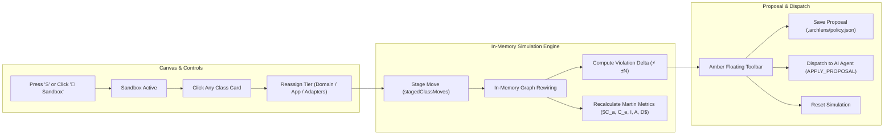

# Architectural Sandbox ("What-If" Prototyping)

Refactoring large codebases is risky when you cannot foresee how moving a class or package will affect the overall system coupling and compliance.

The **Architectural Sandbox** introduces real-time "What-If" prototyping into Archlens. It lets software architects and developers hypothetically reassign classes between concentric rings and packages directly on the canvas without altering a single line of disk code.

---

## 🧪 How It Works

---

## ⚡ Key Capabilities

### 1. Zero-Disk In-Memory Prototyping
When Sandbox mode is enabled (keyboard shortcut `S`), a reactive simulation overlay is activated. When you reassign a class from `adapters` to `application`:
- The class node visually migrates to the target ring.
- Inward and outward dependency edges dynamically re-evaluate their compliance rules.
- If a formerly illegal outward edge now points inward, it flips from a crimson dashed violation arrow into a compliant solid arrow.

### 2. Live Violation Delta Tracking
The floating bottom toolbar maintains a continuous delta calculation:
- **`⚡ -2 Violations`**: Indicates the simulated move successfully eliminated two architectural breaches.
- **`⚡ +1 Violation`**: Alerts you that the move inadvertently introduced a new outward dependency violation.

### 3. Integrated Robert C. Martin Metrics Drawer
Clicking **`Metrics & Staged`** on the bottom dock opens a slide-out drawer displaying live coupling metrics for every component in the simulated architecture:
- Afferent Coupling ($C_a$) & Efferent Coupling ($C_e$)
- Instability index ($I$)
- Abstractness ($A$)
- Normalized distance from the Main Sequence ($D$)
- Visual zone tags: `Zone of Pain`, `Zone of Uselessness`, or `Balanced`.

### 4. Proposals & AI Dispatch
- **Save Proposal**: Persists the hypothetical reorganization as a named structural proposal in `.archlens/policy.json` (`proposals` array).
- **Dispatch to AI Agent**: Formats the complete proposal into an `APPLY_PROPOSAL` command and queues it to `.archlens/to-agent.json`. Your autonomous coding assistant (Claude / Antigravity) will systematically refactor the project's packages and namespaces to conform to your sandboxed blueprint.
- **Reset**: Instantly rolls back all staged moves and returns to the active disk architecture.
