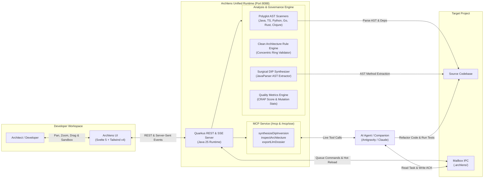
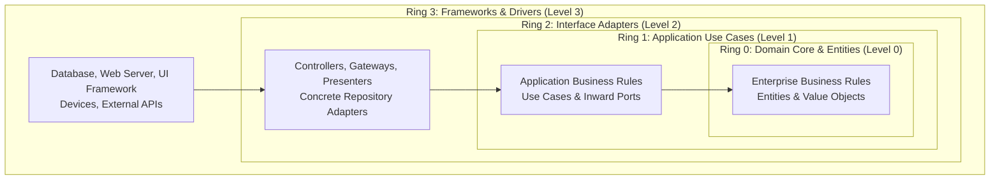

# System Architecture

Archlens is engineered as a unified, high-performance Clean Architecture analysis and governance platform. It pairs a **reactive Java 25 backend** with a **Svelte 5 frontend**, coupled via high-frequency Server-Sent Events (SSE) and Model Context Protocol (MCP) transports.

---

## 🏛️ High-Level System Architecture

---

## 🎯 The Concentric Rings

Archlens enforces Robert C. Martin's concentric Clean Architecture rings:

### The Invariant Dependency Rule
> **Dependencies must point strictly inward.**  
> A class in **Level 0 (Domain Core)** must NEVER depend on **Level 1 (Application)**, **Level 2 (Adapters)**, or **Level 3 (Frameworks)**. Any outward edge ($\text{Level}_{\text{from}} < \text{Level}_{\text{to}}$) is immediately flagged as an **Architectural Breach (Violation)** in neon crimson.

---

## ⚡ Polyglot AST Engine (SPI)

The backend employs an extensible Service Provider Interface (SPI) for scanning multiple languages:
- **Java**: JavaParser 3.26 full AST parsing (records, sealed interfaces, classes, annotations, imports).
- **TypeScript & JavaScript**: Babel AST parser and regex tokenization for ESM modules and barrel exports.
- **Python**: Python AST token visitor for modules, classes, and intra-package imports.
- **Go**: Go standard AST parser detecting packages, structs, and interfaces.
- **Rust**: Syn / Cargo metadata extractor detecting crates, modules, and `use` declarations.
- **Clojure**: EDN reader and namespace dependency parser.

---

## 🔄 Reactive Svelte 5 Frontend

The user interface uses Svelte 5 Runes for state management and UI reactivity:
- **`$state`**: Holds active architecture models, graph components, and sandbox simulation layers.
- **`$derived`**: Reactively recalculates Robert C. Martin metrics ($C_a, C_e, I, A, D$), violation deltas, and edge styles on every staged move.
- **`$effect`**: Drives high-performance GSAP transitions and canvas re-layouts.
- **EventSource (`/api/events`)**: Connects to the backend SSE stream, reacting instantaneously to file saves, agent mailbox updates, and live AST refreshes.
