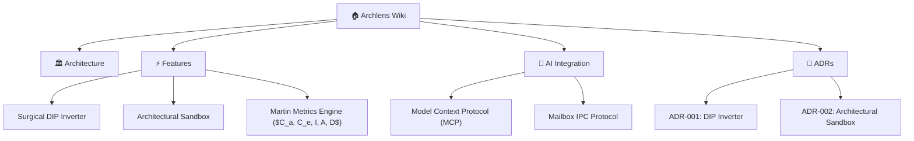

# Welcome to the Archlens Wiki

> *"The Dependency Rule: Source code dependencies must point only inward, toward higher-level policies."*  
> — **Robert C. Martin (Uncle Bob)**

**Archlens** is an interactive, real-time architectural visualization workbench, polyglot Clean Architecture governance engine, and autonomous AI refactoring platform for modern software systems.

Inspired by Robert C. Martin's [unclebob/uml-viewer](https://github.com/unclebob/uml-viewer), Archlens transforms the abstract Dependency Rule into a living, tactile feedback loop right in your browser, backed by rich AST analysis across Java 25, Python, TypeScript, Rust, Go, and Clojure.

---

## 🧭 Wiki Directory

### Core Architecture & Foundations
- **[System Architecture](Architecture)**: The C4 model, Quarkus Java 25 reactive core, Svelte 5 runes, and polyglot AST scanners.
- **[Concentric Rings & Governance](Architecture#the-concentric-rings)**: Ring tiers (`Domain Core`, `Application`, `Adapters`, `Frameworks`) and level inversion validation.

### Features & Capabilities
- **[Surgical DIP Inverter](Surgical-DIP-Inverter)**: 1-click violation remediation, Java interface port synthesis, caller/adapter diffs, and surgical AI directives.
- **[Architectural Sandbox & Prototyping](Architectural-Sandbox)**: "What-If" simulation, staged class moves, real-time violation deltas, and proposal management.
- **[Robert C. Martin Metrics Engine](Robert-C-Martin-Metrics)**: Coupling and stability metrics ($C_a, C_e, I, A, D$), Zone of Pain vs. Zone of Uselessness, and Main Sequence balance.

### AI Companions & Integration
- **[Model Context Protocol (MCP) Integration](MCP-Integration)**: Native Quarkus MCP server endpoints (`/mcp` and `/mcp/sse`), tool schemas (`synthesizeDipInversion`, `inspectArchitecture`, `exportLlmDossier`), and client configuration for Claude, Antigravity, and Cursor.
- **[Mailbox IPC Companion Protocol](Mailbox-IPC)**: Asynchronous IPC between the visual workbench and coding assistants via `.archlens/to-agent.json` and `.archlens/to-viewer.json`.

### Architectural Decision Records (ADRs)
- **[ADR-001: Surgical DIP Inverter](ADR-001-Surgical-DIP-Inverter)**: Rationale, alternatives, and technical design for 1-click AST interface extraction.
- **[ADR-002: Interactive Architectural Sandbox](ADR-002-Interactive-Architectural-Sandbox)**: Rationale and technical design for in-memory graph simulation and Martin metrics.

---

## ⚡ Quick Navigation

