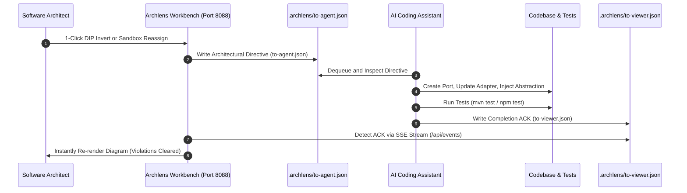

# Mailbox IPC Companion Protocol

The **Mailbox IPC Protocol** is the asynchronous bridge connecting the Archlens Visual Workbench with autonomous AI coding assistants (such as Claude Code, Google Antigravity, and Cursor).

Rather than forcing the developer to manually copy instructions or run multiple CLI tools, Archlens provides file-based mailbox queues located inside the project's `.archlens/` directory.

---

## 📬 Protocol Architecture



---

## 🗂️ Mailbox Files

| File Path | Role | Direction |
| :--- | :--- | :--- |
| `.archlens/to-agent.json` | Inbound command queue for the AI agent | Workbench $\to$ Agent |
| `.archlens/to-viewer.json` | Outbound response and ACK log | Agent $\to$ Workbench |

---

## 📋 Mailbox Command Reference

### 1. `INVERT_DEPENDENCY`
Dispatched when clicking **`Dispatch to AI Agent`** in the **Surgical DIP Inverter modal**.

```json
{
  "command": "INVERT_DEPENDENCY",
  "commandId": "cmd-1727488000000",
  "timestamp": "2026-09-28T02:00:00Z",
  "payload": {
    "fromClass": "io.slixes.archlens.mcp.ArchlensMcpService",
    "toClass": "io.slixes.archlens.resource.DiagramResource",
    "portName": "DiagramResourcePort",
    "portPackage": "io.slixes.archlens.mcp.ports",
    "portFilePath": "/workspace/src/main/java/io/slixes/archlens/mcp/ports/DiagramResourcePort.java",
    "portInterfaceCode": "package io.slixes.archlens.mcp.ports;\n\npublic interface DiagramResourcePort {\n    // Extracted public method signatures\n}\n",
    "adapterRefactorPreview": "...",
    "callerRefactorPreview": "..."
  }
}
```

#### Expected Agent Actions:
1. Write the synthesized port interface to `portFilePath`.
2. Update the concrete adapter (`toClass`) to implement `portName`.
3. Refactor caller (`fromClass`) to inject the port interface.
4. Run project test suite (`mvn test`).
5. Write ACK to `.archlens/to-viewer.json`.

---

### 2. `APPLY_PROPOSAL`
Dispatched when clicking **`Dispatch to Agent`** from the **Architectural Sandbox toolbar**.

```json
{
  "command": "APPLY_PROPOSAL",
  "commandId": "cmd-1727488001000",
  "timestamp": "2026-09-28T02:05:00Z",
  "payload": {
    "proposalId": "proposal-reorganize-core",
    "stagedClassMoves": {
      "com.example.service.LegacyService": 1,
      "com.example.repo.RawDbAdapter": 2
    }
  }
}
```

#### Expected Agent Actions:
1. Move classes to match the proposed concentric ring packages.
2. Update import statements across the codebase.
3. Run test suites and verify compilation.
4. Acknowledge completion in `.archlens/to-viewer.json`.

---

### 3. `REGEN`
Dispatched when clicking the **`Regen`** button in the workbench navigation bar.
- Directs the agent to re-scan the codebase AST, evaluate package dependency rules, and verify architectural invariants.

---

### 4. `REFRESH_CRAP`
Dispatched when requesting refreshed code complexity and mutation metrics.
- Directs the agent to run unit test coverage (JaCoCo) and mutation testing (PITest / Stryker) to update CRAP risk scores.
