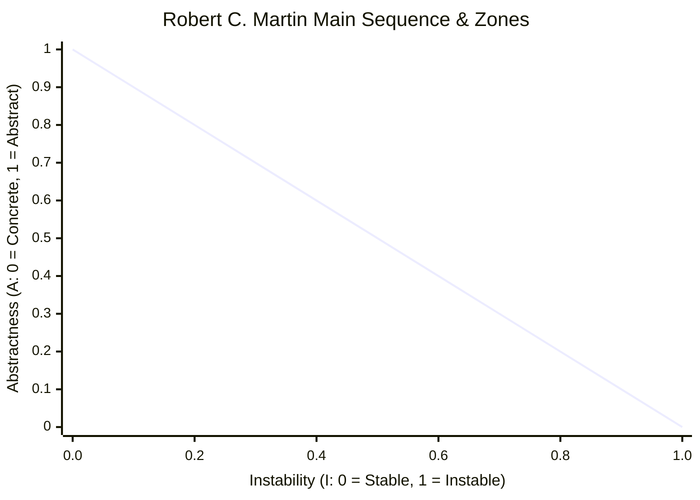

# Robert C. Martin Coupling & Stability Metrics

In *Clean Architecture* and *Agile Software Development: Principles, Patterns, and Practices*, Robert C. Martin (Uncle Bob) formalized mathematical metrics to evaluate the stability, abstractness, and balance of software packages and components.

Archlens implements Uncle Bob's complete metrics suite natively in both the active architecture analyzer and the interactive sandbox simulation engine.

---

## 📐 The Metric Formulations

### 1. Afferent Coupling ($C_a$)
The number of classes outside this component that depend on classes inside this component (incoming dependencies / incoming callers).
$$\text{Responsibility Measure}$$

### 2. Efferent Coupling ($C_e$)
The number of classes inside this component that depend on classes outside this component (outgoing dependencies / outgoing callees).
$$\text{Dependence Measure}$$

### 3. Instability ($I$)
The ratio of efferent coupling to total coupling.
$$I = \frac{C_e}{C_a + C_e}$$
- $I = 0.0$ $\rightarrow$ **Maximally Stable**: Many incoming dependencies ($C_a > 0$) and no outgoing dependencies ($C_e = 0$). Hard to change because many other components rely on it.
- $I = 1.0$ $\rightarrow$ **Maximally Instable**: No incoming dependencies ($C_a = 0$) and many outgoing dependencies ($C_e > 0$). Easy to change because no other components rely on it.

### 4. Abstractness ($A$)
The ratio of abstract classes and interfaces to total classes in the component.
$$A = \frac{N_a}{N_c}$$
- Where $N_a$ is the count of interfaces and abstract classes, and $N_c$ is the total class count.
- $A = 0.0$ $\rightarrow$ Purely concrete component.
- $A = 1.0$ $\rightarrow$ Purely abstract interface package.

---

## 📈 The Main Sequence & Architectural Zones

Uncle Bob established that stable components should be abstract, while unstable components should be concrete. The ideal relationship forms a line from $(A=0, I=1)$ to $(A=1, I=0)$, known as the **Main Sequence**:

$$A + I = 1$$



### 5. Normalized Distance from the Main Sequence ($D$)
The perpendicular distance of a component from the ideal Main Sequence line:
$$D = |A + I - 1|$$
- **$D = 0.0$**: The component sits directly on the Main Sequence, achieving balance between stability and abstractness.
- **$D \to 1.0$**: The component deviates severely from architectural balance.

---

## ⚠️ Architectural Zones

Archlens automatically classifies every component into one of three architectural health zones:

```text
Abstractness (A)
   ^
1.0| [Zone of Uselessness]       \
   |  (High Abstractness,         \
   |   High Instability)           \
   |                                \  Main Sequence Line (A + I = 1)
   |                                 \
   |       [Balanced Zone]            \
   |                                   \
   |                                    \
   | [Zone of Pain]                      \
0.0+---------------------------------------> Instability (I)
  0.0                                    1.0
```

### 🔴 The Zone of Pain ($A \approx 0, I \approx 0$)
- **Characteristics**: Highly concrete ($A \to 0$) and highly stable ($I \to 0$).
- **Symptom**: Many other components depend on it, but it contains no abstract interfaces.
- **Risk**: Extremely rigid and painful to change. Any modification breaks dependent modules.
- **Remedy**: Introduce interfaces using the **Surgical DIP Inverter**.

### 🟡 The Zone of Uselessness ($A \approx 1, I \approx 1$)
- **Characteristics**: Highly abstract ($A \to 1$) and highly instable ($I \to 1$).
- **Symptom**: Composed of pure interfaces or abstract classes, yet no other components depend on them.
- **Risk**: Dead code or speculative over-engineering.
- **Remedy**: Consolidate or eliminate unused abstractions.

### 🟢 The Balanced Zone ($D \le 0.4$)
- **Characteristics**: Components that track closely along the Main Sequence line.
- **Outcome**: Concrete components are instable (easy to change, few dependents), and stable components are abstract (extensible via polymorphism).
