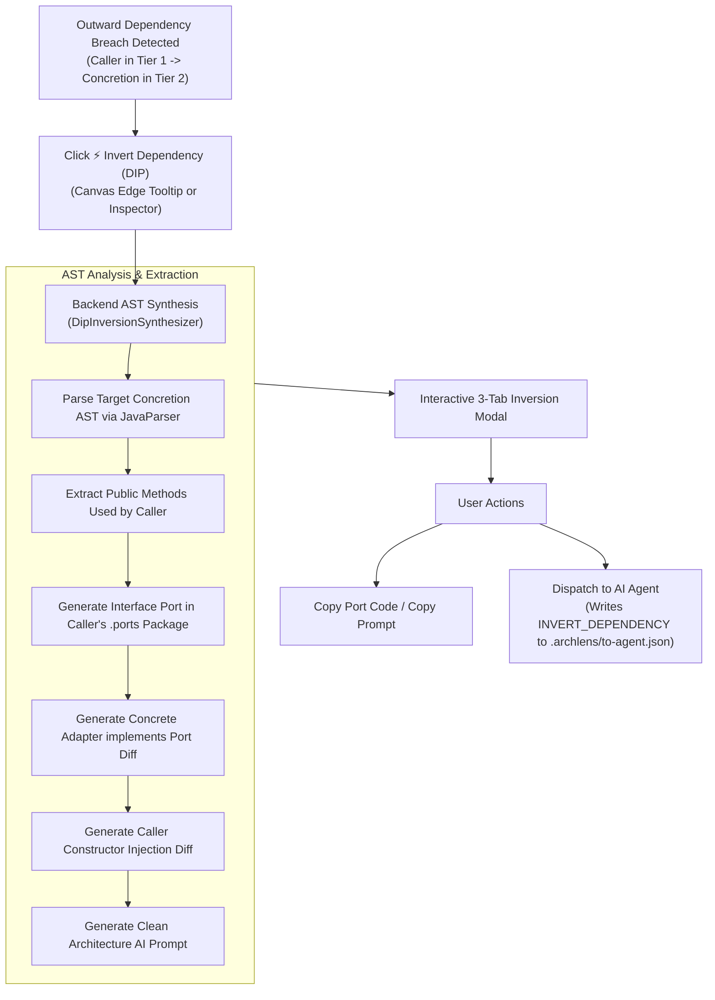

# Surgical DIP Inverter

> *"High-level modules should not depend on low-level modules. Both should depend on abstractions. Abstractions should not depend on details. Details should depend on abstractions."*  
> — **Robert C. Martin (The Dependency Inversion Principle)**

The **Surgical DIP Inverter** transforms violation remediation from a tedious manual chore into a 1-click automated operation. Instead of merely alerting you to an outward Clean Architecture violation, Archlens automatically analyzes the participating classes, synthesizes the exact Java interface port, previews the adapter and caller diffs, and dispatches a refactoring directive to your AI companion.

---

## ⚡ How It Works



---

## 📋 The 3-Tab Inversion Modal

When opening the DIP Inverter on any violating edge, Archlens presents a structured 3-tab modal:

### 1. Synthesized Port (`.ports`)
Displays the freshly generated interface port. Archlens automatically:
- Places the port in an inner subpackage (e.g. `com.example.service.ports`).
- Names the interface with standard port nomenclature (e.g. `OrderRepositoryPort`).
- Extracts public method signatures with parameters and return types directly from the target concretion's AST.

```java
package com.example.service.ports;

/**
 * Clean Architecture Interface Port.
 * Synthesized by Archlens to invert outward dependency from:
 *   com.example.service.OrderService (Level 1)
 * to outer concrete implementation:
 *   com.example.db.PostgresOrderRepo (Level 2)
 */
public interface OrderRepositoryPort {
    Order findById(String id);
    void save(Order order);
    List<Order> listActive();
}
```

### 2. Refactor Previews
Side-by-side previews of how the participating classes will change:
- **The Concrete Adapter** (Outer Tier): Updates the concrete class to implement the new interface port:
  ```java
  public class PostgresOrderRepo implements OrderRepositoryPort {
      // Concrete database queries...
  }
  ```
- **The Caller** (Inner Tier): Refactors the caller to inject the interface abstraction rather than instantiating or referencing the concrete adapter:
  ```java
  public class OrderService {
      private final OrderRepositoryPort orderRepositoryPort;

      public OrderService(OrderRepositoryPort orderRepositoryPort) {
          this.orderRepositoryPort = orderRepositoryPort;
      }
  }
  ```

### 3. AI Refactoring Prompt
A ready-to-run prompt formatted for LLMs (Claude, Antigravity, GPT-4) detailing:
- The violating source and target classes with their tier levels.
- File paths for the new port and the files to refactor.
- Step-by-step TDD verification instructions (`mvn test`).

---

## 🤖 Dispatching to AI Assistants

Clicking **`Dispatch to AI Agent`** sends the entire DIP plan into [`.archlens/to-agent.json`](file:///Users/fady/workspace/labs/unclebob-design/.archlens/to-agent.json):

```json
{
  "command": "INVERT_DEPENDENCY",
  "commandId": "cmd-1727488000000",
  "timestamp": "2026-09-28T02:00:00Z",
  "payload": {
    "fromClass": "com.example.service.OrderService",
    "toClass": "com.example.db.PostgresOrderRepo",
    "portName": "OrderRepositoryPort",
    "portPackage": "com.example.service.ports",
    "portFilePath": "/path/to/project/src/main/java/com/example/service/ports/OrderRepositoryPort.java",
    "portInterfaceCode": "package com.example.service.ports;\n\npublic interface OrderRepositoryPort { ... }\n"
  }
}
```

When your companion agent reads this command, it applies the changes, runs tests, and posts back to `.archlens/to-viewer.json`. The workbench detects the file change via SSE and immediately re-renders the diagram with the crimson violating edge eliminated!

---

## 🛠️ MCP Tool Equivalent

AI assistants can also invoke the DIP inverter directly without using the UI:

```json
{
  "tool": "synthesizeDipInversion",
  "arguments": {
    "fromClass": "com.example.service.OrderService",
    "toClass": "com.example.db.PostgresOrderRepo",
    "projectRoot": "."
  }
}
```
*(See the [MCP Integration Guide](MCP-Integration) for complete documentation).*
